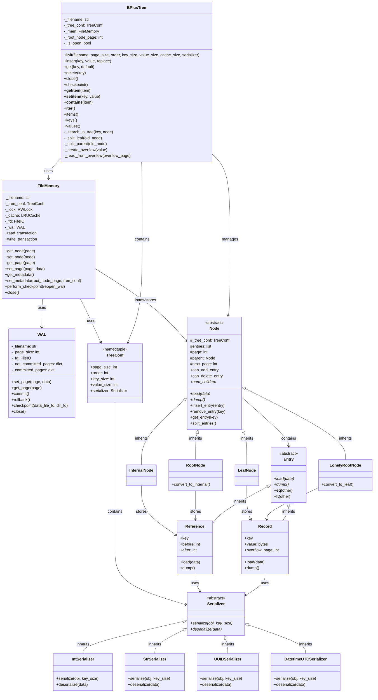
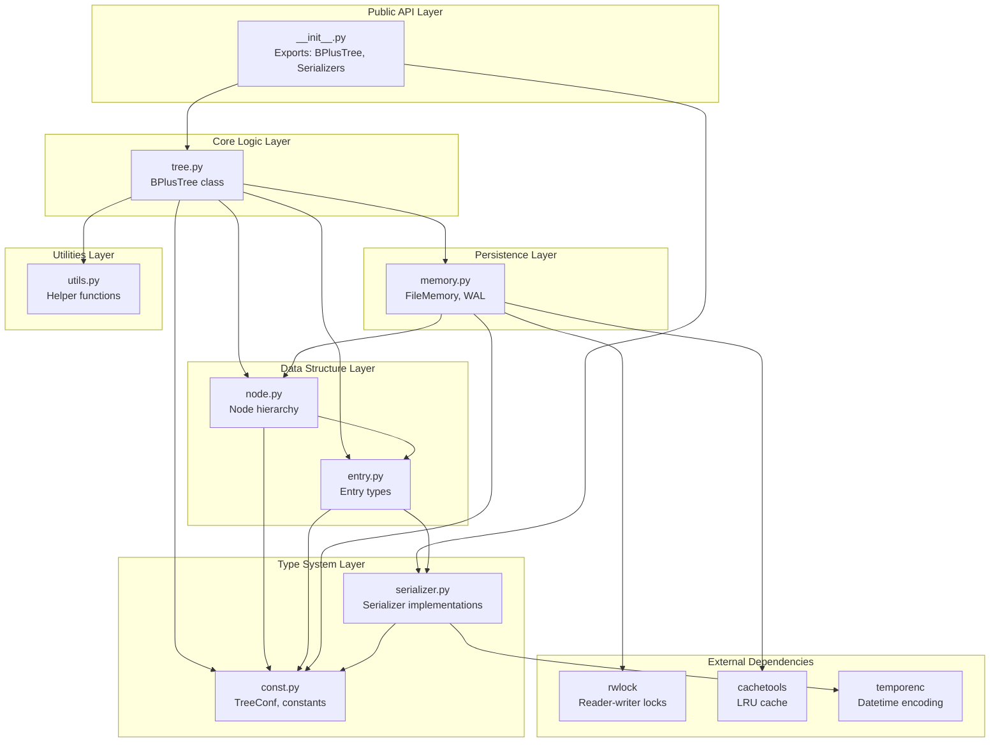
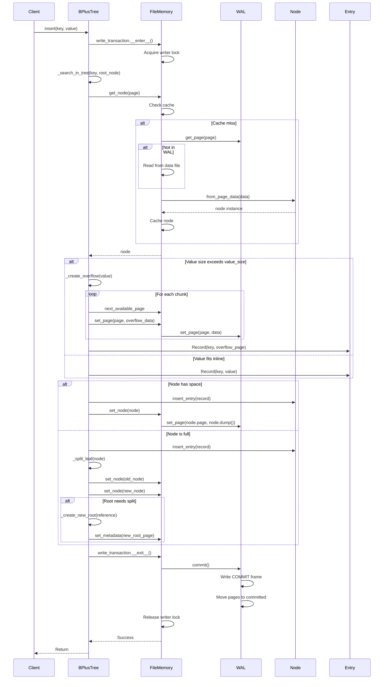
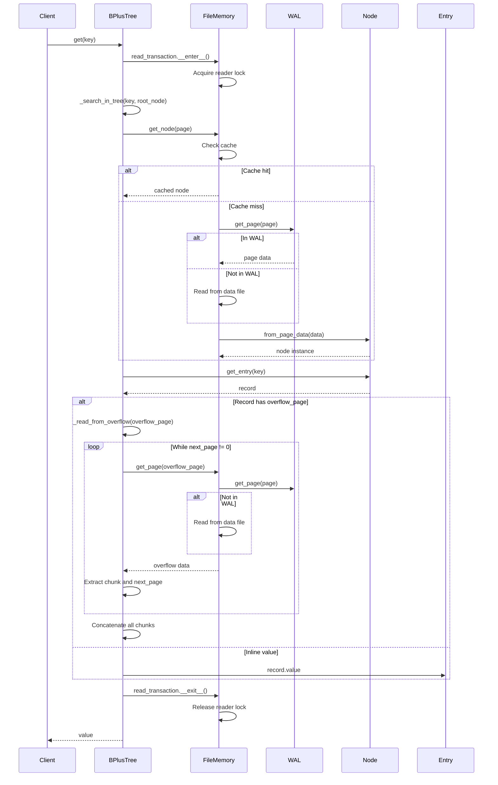

## UML Class Diagram

## Package Relationship Diagram

This diagram shows the module dependencies and layered architecture:

## Sequence Diagram: Insert Operation

## Sequence Diagram: Get Operation

