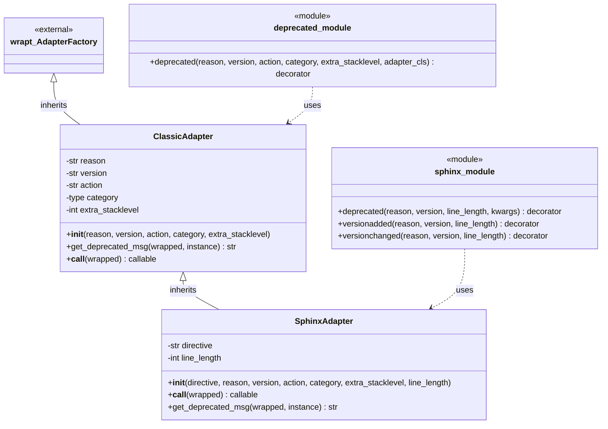
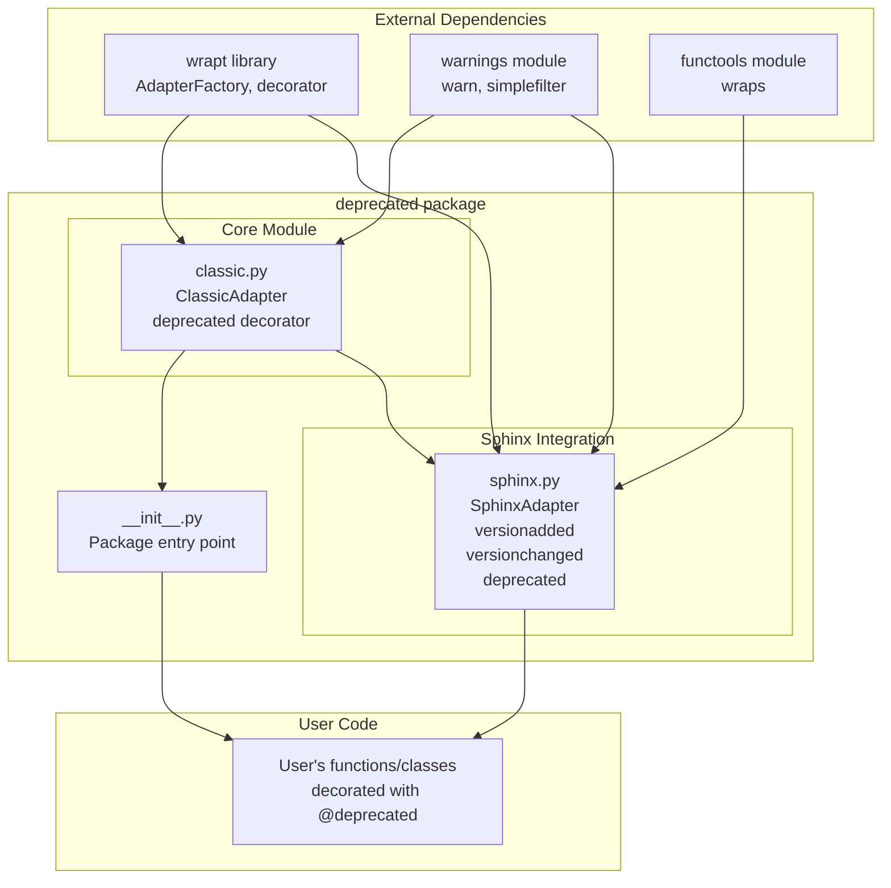
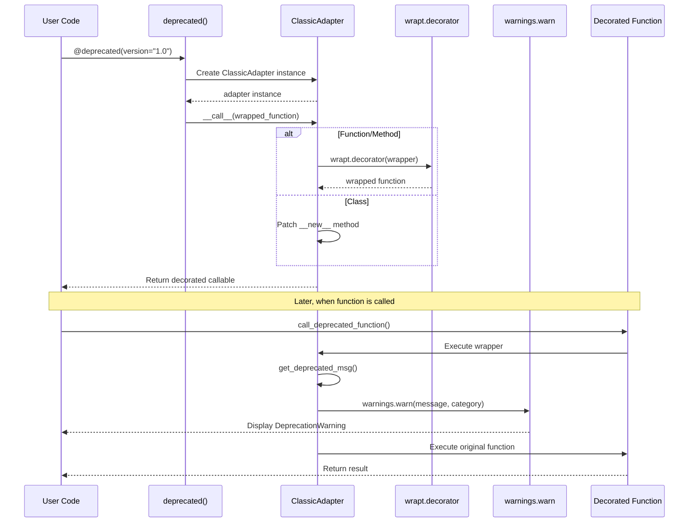
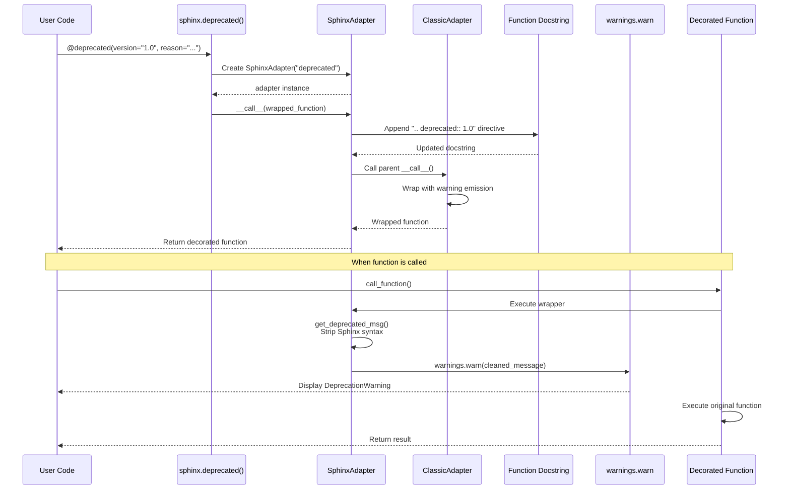

## UML Class Diagram

```mermaid
classDiagram
    class wrapt_AdapterFactory {
        <<external>>
    }
    
    class ClassicAdapter {
        -str reason
        -str version
        -str action
        -type category
        -int extra_stacklevel
        +__init__(reason, version, action, category, extra_stacklevel)
        +get_deprecated_msg(wrapped, instance) str
        +__call__(wrapped) callable
    }
    
    class SphinxAdapter {
        -str directive
        -int line_length
        +__init__(directive, reason, version, action, category, extra_stacklevel, line_length)
        +__call__(wrapped) callable
        +get_deprecated_msg(wrapped, instance) str
    }
    
    class deprecated_module {
        <<module>>
        +deprecated(reason, version, action, category, extra_stacklevel, adapter_cls) decorator
    }
    
    class sphinx_module {
        <<module>>
        +deprecated(reason, version, line_length, kwargs) decorator
        +versionadded(reason, version, line_length) decorator
        +versionchanged(reason, version, line_length) decorator
    }
    
    wrapt_AdapterFactory <|-- ClassicAdapter : inherits
    ClassicAdapter <|-- SphinxAdapter : inherits
    deprecated_module ..> ClassicAdapter : uses
    sphinx_module ..> SphinxAdapter : uses
```

## Package Relationship Diagram

```mermaid
graph TB
    subgraph "External Dependencies"
        WRAPT["wrapt library<br/>AdapterFactory, decorator"]
        WARNINGS["warnings module<br/>warn, simplefilter"]
        FUNCTOOLS["functools module<br/>wraps"]
    end
    
    subgraph "deprecated package"
        INIT["__init__.py<br/>Package entry point"]
        
        subgraph "Core Module"
            CLASSIC["classic.py<br/>ClassicAdapter<br/>deprecated decorator"]
        end
        
        subgraph "Sphinx Integration"
            SPHINX["sphinx.py<br/>SphinxAdapter<br/>versionadded<br/>versionchanged<br/>deprecated"]
        end
    end
    
    subgraph "User Code"
        USER["User's functions/classes<br/>decorated with @deprecated"]
    end
    
    WRAPT --> CLASSIC
    WRAPT --> SPHINX
    WARNINGS --> CLASSIC
    WARNINGS --> SPHINX
    FUNCTOOLS --> SPHINX
    
    CLASSIC --> INIT
    INIT --> USER
    SPHINX --> USER
    CLASSIC --> SPHINX
```

## Sequence Diagram: Using @deprecated Decorator

```mermaid
sequenceDiagram
    participant User as User Code
    participant Decorator as deprecated()
    participant Adapter as ClassicAdapter
    participant Wrapt as wrapt.decorator
    participant Warnings as warnings.warn
    participant Function as Decorated Function
    
    User->>Decorator: @deprecated(version="1.0")
    Decorator->>Adapter: Create ClassicAdapter instance
    Adapter-->>Decorator: adapter instance
    Decorator->>Adapter: __call__(wrapped_function)
    
    alt Function/Method
        Adapter->>Wrapt: wrapt.decorator(wrapper)
        Wrapt-->>Adapter: wrapped function
    else Class
        Adapter->>Adapter: Patch __new__ method
    end
    
    Adapter-->>User: Return decorated callable
    
    Note over User,Function: Later, when function is called
    
    User->>Function: call_deprecated_function()
    Function->>Adapter: Execute wrapper
    Adapter->>Adapter: get_deprecated_msg()
    Adapter->>Warnings: warnings.warn(message, category)
    Warnings-->>User: Display DeprecationWarning
    Adapter->>Function: Execute original function
    Function-->>User: Return result
``` 

## Sequence Diagram: Using Sphinx @deprecated Decorator

```mermaid
sequenceDiagram
    participant User as User Code
    participant SphinxDec as sphinx.deprecated()
    participant SphinxAdapter as SphinxAdapter
    participant ClassicAdapter as ClassicAdapter
    participant Docstring as Function Docstring
    participant Warnings as warnings.warn
    participant Function as Decorated Function
    
    User->>SphinxDec: @deprecated(version="1.0", reason="...")
    SphinxDec->>SphinxAdapter: Create SphinxAdapter("deprecated")
    SphinxAdapter-->>SphinxDec: adapter instance
    SphinxDec->>SphinxAdapter: __call__(wrapped_function)
    
    SphinxAdapter->>Docstring: Append ".. deprecated:: 1.0" directive
    Docstring-->>SphinxAdapter: Updated docstring
    
    SphinxAdapter->>ClassicAdapter: Call parent __call__()
    ClassicAdapter->>ClassicAdapter: Wrap with warning emission
    ClassicAdapter-->>SphinxAdapter: Wrapped function
    
    SphinxAdapter-->>User: Return decorated function
    
    Note over User,Function: When function is called
    
    User->>Function: call_function()
    Function->>SphinxAdapter: Execute wrapper
    SphinxAdapter->>SphinxAdapter: get_deprecated_msg()<br/>Strip Sphinx syntax
    SphinxAdapter->>Warnings: warnings.warn(cleaned_message)
    Warnings-->>User: Display DeprecationWarning
    Function->>Function: Execute original function
    Function-->>User: Return result
```
