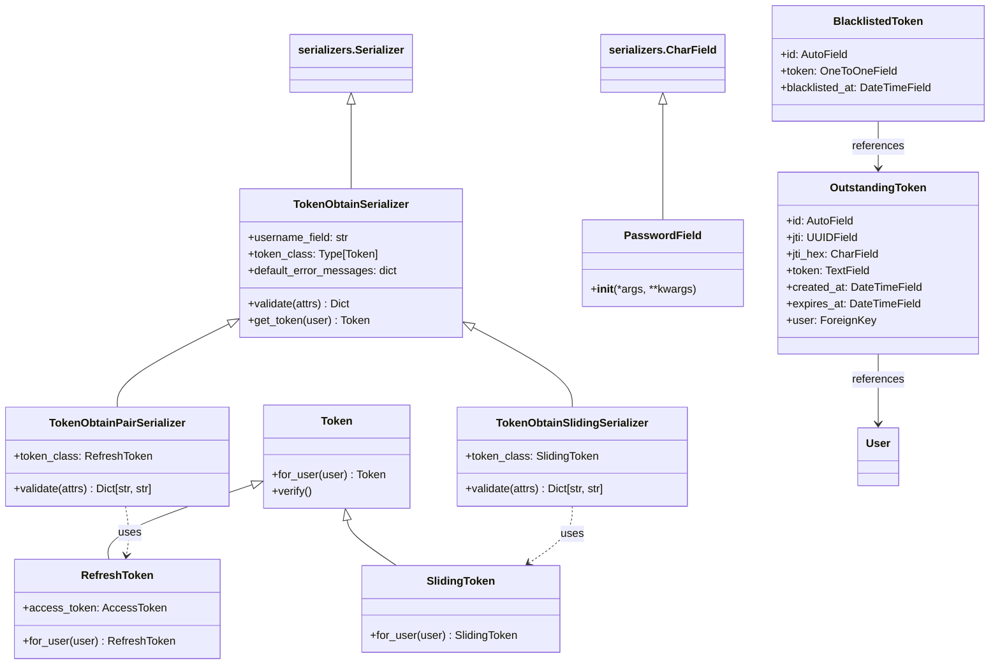
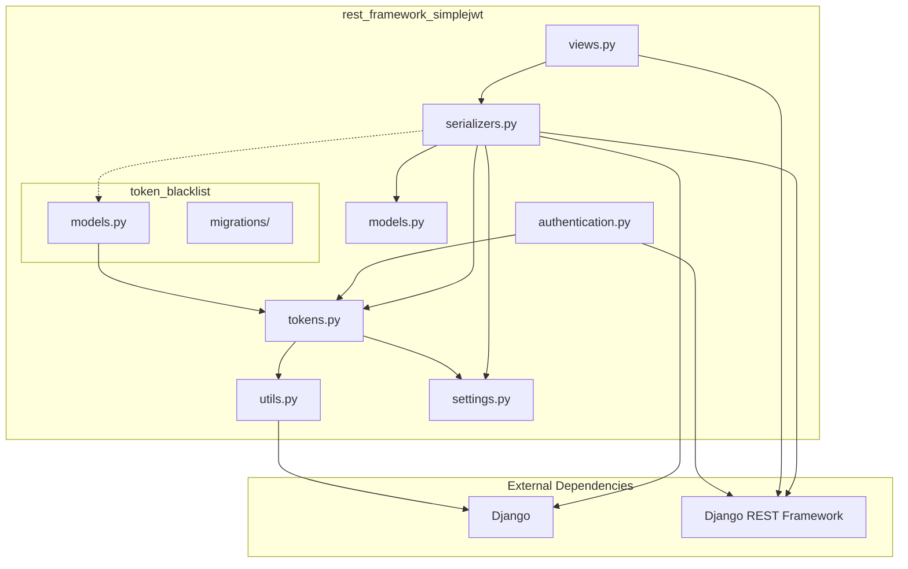
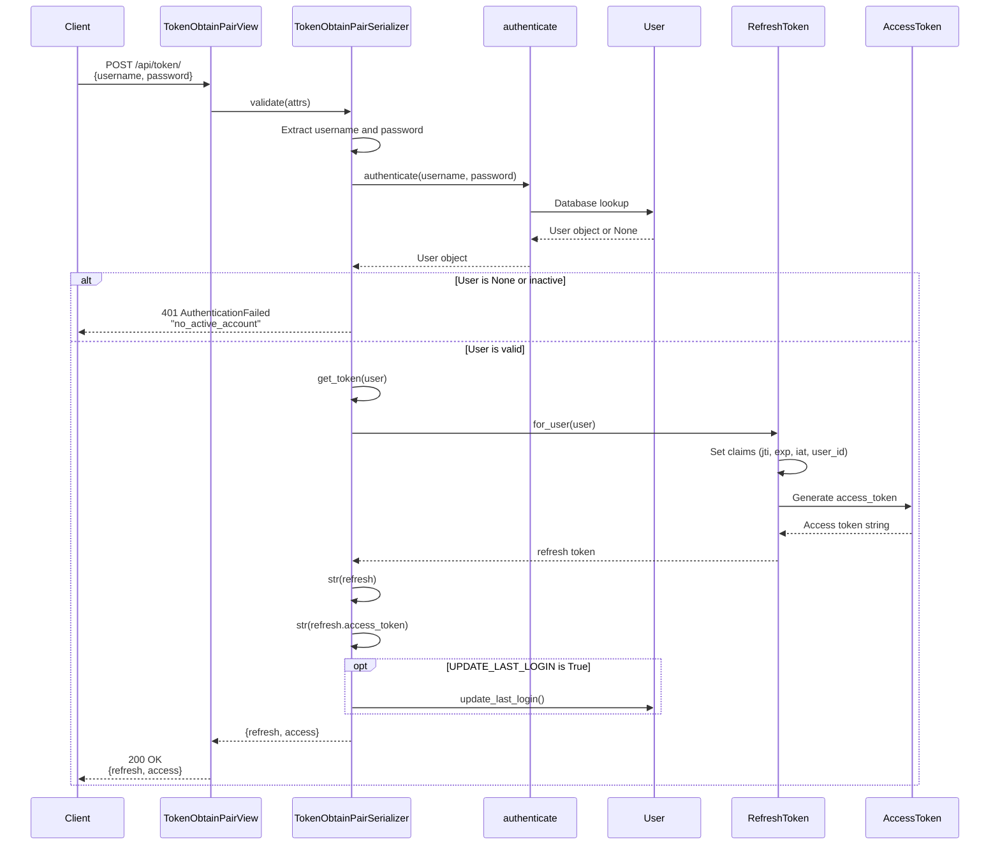

## Class Diagram

```mermaid
classDiagram
    class TokenObtainSerializer {
        +username_field: str
        +token_class: Type[Token]
        +default_error_messages: dict
        +validate(attrs) Dict
        +get_token(user) Token
    }
    
    class TokenObtainPairSerializer {
        +token_class: RefreshToken
        +validate(attrs) Dict[str, str]
    }
    
    class TokenObtainSlidingSerializer {
        +token_class: SlidingToken
        +validate(attrs) Dict[str, str]
    }
    
    class PasswordField {
        +__init__(*args, **kwargs)
    }
    
    class RefreshToken {
        +for_user(user) RefreshToken
        +access_token: AccessToken
    }
    
    class SlidingToken {
        +for_user(user) SlidingToken
    }
    
    class Token {
        +for_user(user) Token
        +verify()
    }
    
    class OutstandingToken {
        +id: AutoField
        +jti: UUIDField
        +jti_hex: CharField
        +token: TextField
        +created_at: DateTimeField
        +expires_at: DateTimeField
        +user: ForeignKey
    }
    
    class BlacklistedToken {
        +id: AutoField
        +token: OneToOneField
        +blacklisted_at: DateTimeField
    }
    
    serializers.Serializer <|-- TokenObtainSerializer
    TokenObtainSerializer <|-- TokenObtainPairSerializer
    TokenObtainSerializer <|-- TokenObtainSlidingSerializer
    serializers.CharField <|-- PasswordField
    
    Token <|-- RefreshToken
    Token <|-- SlidingToken
    
    TokenObtainPairSerializer ..> RefreshToken : uses
    TokenObtainSlidingSerializer ..> SlidingToken : uses
    
    BlacklistedToken --> OutstandingToken : references
    OutstandingToken --> User : references
```
## Package Relationship Diagram

```mermaid
graph TB
    subgraph "rest_framework_simplejwt"
        serializers["serializers.py"]
        tokens["tokens.py"]
        views["views.py"]
        authentication["authentication.py"]
        models["models.py"]
        utils["utils.py"]
        settings["settings.py"]
        
        subgraph "token_blacklist"
            blacklist_models["models.py"]
            blacklist_migrations["migrations/"]
        end
    end
    
    subgraph "External Dependencies"
        django["Django"]
        drf["Django REST Framework"]
    end
    
    serializers --> tokens
    serializers --> models
    serializers --> settings
    serializers --> django
    serializers --> drf
    
    views --> serializers
    views --> drf
    
    authentication --> tokens
    authentication --> drf
    
    tokens --> utils
    tokens --> settings
    
    blacklist_models --> tokens
    serializers -.-> blacklist_models
    
    utils --> django
```

## Sequence Diagram - Token Obtain Flow

```mermaid
sequenceDiagram
    participant Client
    participant TokenObtainPairView
    participant TokenObtainPairSerializer
    participant authenticate
    participant User
    participant RefreshToken
    participant AccessToken
    
    Client->>TokenObtainPairView: POST /api/token/<br/>{username, password}
    TokenObtainPairView->>TokenObtainPairSerializer: validate(attrs)
    
    TokenObtainPairSerializer->>TokenObtainPairSerializer: Extract username and password
    TokenObtainPairSerializer->>authenticate: authenticate(username, password)
    authenticate->>User: Database lookup
    User-->>authenticate: User object or None
    authenticate-->>TokenObtainPairSerializer: User object
    
    alt User is None or inactive
        TokenObtainPairSerializer-->>Client: 401 AuthenticationFailed<br/>"no_active_account"
    else User is valid
        TokenObtainPairSerializer->>TokenObtainPairSerializer: get_token(user)
        TokenObtainPairSerializer->>RefreshToken: for_user(user)
        RefreshToken->>RefreshToken: Set claims (jti, exp, iat, user_id)
        RefreshToken->>AccessToken: Generate access_token
        AccessToken-->>RefreshToken: Access token string
        RefreshToken-->>TokenObtainPairSerializer: refresh token
        
        TokenObtainPairSerializer->>TokenObtainPairSerializer: str(refresh)
        TokenObtainPairSerializer->>TokenObtainPairSerializer: str(refresh.access_token)
        
        opt UPDATE_LAST_LOGIN is True
            TokenObtainPairSerializer->>User: update_last_login()
        end
        
        TokenObtainPairSerializer-->>TokenObtainPairView: {refresh, access}
        TokenObtainPairView-->>Client: 200 OK<br/>{refresh, access}
    end
```