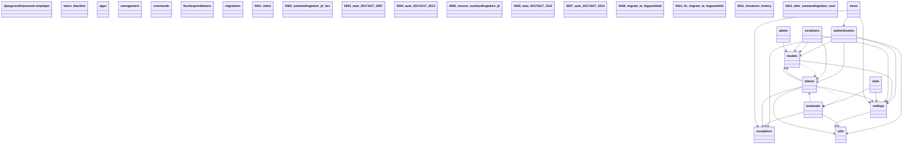

## UML Class Diagram

```mermaid
classDiagram
  class JWTAuthentication {
    media_type : str
    user_model
    www_authenticate_realm : str
    authenticate(request: Request) Optional[Tuple[AuthUser, Token]]
    authenticate_header(request: Request) str
    get_header(request: Request) bytes
    get_raw_token(header: bytes) Optional[bytes]
    get_user(validated_token: Token) AuthUser
    get_validated_token(raw_token: bytes) Token
  }
  class JWTStatelessUserAuthentication {
    get_user(validated_token: Token) AuthUser
  }
  class TokenBackend {
    algorithm : str
    audience : Optional[Union[str, Iterable, None]]
    issuer : Optional[str]
    json_encoder : Optional[Type[json.JSONEncoder]]
    jwks_client : NoneType
    leeway : Optional[Union[float, int, timedelta, None]]
    signing_key : Optional[str]
    verifying_key : str
    decode(token: Token, verify: bool) Dict[str, Any]
    encode(payload: Dict[str, Any]) str
    get_leeway() timedelta
    get_verifying_key(token: Token) Optional[str]
  }
  class AuthenticationFailed {
  }
  class DetailDictMixin {
    default_code : str
    default_detail : str
  }
  class InvalidToken {
    default_code : str
    default_detail : \_\_proxy\_\_
    status_code : int
  }
  class TokenBackendError {
  }
  class TokenError {
  }
  class TokenUser {
    groups
    is_active : bool
    is_anonymous
    is_authenticated
    token : str
    user_permissions
    check_password(raw_password: str)* None
    delete()* None
    get_all_permissions(obj: Optional[object]) set
    get_group_permissions(obj: Optional[object]) set
    get_username() str
    has_module_perms(module: str) bool
    has_perm(perm: str, obj: Optional[object]) bool
    has_perms(perm_list: List[str], obj: Optional[object]) bool
    id() Union[int, str]
    is_staff() bool
    is_superuser() bool
    pk() Union[int, str]
    save()* None
    set_password(raw_password: str)* None
    username() str
  }
  class PasswordField {
  }
  class TokenBlacklistSerializer {
    refresh : CharField
    token_class
    validate(attrs: Dict[str, Any]) Dict[Any, Any]
  }
  class TokenObtainPairSerializer {
    token_class
    validate(attrs: Dict[str, Any]) Dict[str, str]
  }
  class TokenObtainSerializer {
    default_error_messages : dict
    token_class : Optional[Type[Token]]
    user
    username_field
    get_token(user: AuthUser) Token
    validate(attrs: Dict[str, Any]) Dict[Any, Any]
  }
  class TokenObtainSlidingSerializer {
    token_class
    validate(attrs: Dict[str, Any]) Dict[str, str]
  }
  class TokenRefreshSerializer {
    access : CharField
    refresh : CharField
    token_class
    validate(attrs: Dict[str, Any]) Dict[str, str]
  }
  class TokenRefreshSlidingSerializer {
    token : CharField
    token_class
    validate(attrs: Dict[str, Any]) Dict[str, str]
  }
  class TokenVerifySerializer {
    token : CharField
    validate(attrs: Dict[str, None]) Dict[Any, Any]
  }
  class APISettings {
  }
  class BlacklistedTokenAdmin {
    list_display : tuple
    ordering : tuple
    search_fields : tuple
    get_queryset() QuerySet
    token_created_at(obj: BlacklistedToken) datetime
    token_expires_at(obj: BlacklistedToken) datetime
    token_jti(obj: BlacklistedToken) str
    token_user(obj: BlacklistedToken) AuthUser
  }
  class OutstandingTokenAdmin {
    actions : NoneType
    list_display : tuple
    ordering : tuple
    search_fields : tuple
    get_queryset() QuerySet
    get_readonly_fields() List[Any]
    has_add_permission() bool
    has_change_permission(request: Request, obj: Optional[object]) bool
    has_delete_permission() bool
  }
  class TokenBlacklistConfig {
    default_auto_field : str
    name : str
    verbose_name : \_\_proxy\_\_
  }
  class Command {
    help : str
    handle() None
  }
  class Migration {
    dependencies : list
    initial : bool
    operations : list
  }
  class Migration {
    dependencies : list
    operations : list
  }
  class Migration {
    dependencies : list
    operations : list
  }
  class Migration {
    dependencies : list
    operations : list
  }
  class Migration {
    dependencies : list
    operations : list
  }
  class Migration {
    dependencies : list
    operations : list
  }
  class Migration {
    dependencies : list
    operations : list
  }
  class Migration {
    dependencies : list
    operations : list
  }
  class Migration {
    dependencies : list
    operations : list
  }
  class Migration {
    dependencies : list
    operations : list
  }
  class Migration {
    dependencies : list
    operations : list
  }
  class BlacklistedToken {
    blacklisted_at : DateTimeField
    id : BigAutoField
    token : OneToOneField
  }
  class Meta {
    abstract
    ordering : tuple
  }
  class Meta {
    abstract
  }
  class OutstandingToken {
    created_at : DateTimeField
    expires_at : DateTimeField
    id : BigAutoField
    jti : CharField
    token : TextField
    user : ForeignKey
  }
  class AccessToken {
    lifetime
    token_type : str
  }
  class BlacklistMixin {
    payload : Dict[str, Any]
    blacklist() BlacklistedToken
    check_blacklist() None
    for_user(user: AuthUser) Token
    verify() None
  }
  class RefreshToken {
    access_token
    access_token_class
    lifetime
    no_copy_claims : tuple
    token_type : str
  }
  class SlidingToken {
    lifetime
    token_type : str
  }
  class Token {
    current_time
    lifetime : Optional[timedelta]
    payload : dict
    token : Optional['Token']
    token_backend
    token_type : Optional[str]
    check_exp(claim: str, current_time: Optional[datetime]) None
    for_user(user: AuthUser) 'Token'
    get(key: str, default: Optional[Any]) Any
    get_token_backend() 'TokenBackend'
    set_exp(claim: str, from_time: Optional[datetime], lifetime: Optional[timedelta]) None
    set_iat(claim: str, at_time: Optional[datetime]) None
    set_jti() None
    verify() None
    verify_token_type() None
  }
  class UntypedToken {
    lifetime : timedelta
    token_type : str
    verify_token_type()* None
  }
  class TokenBlacklistView {
  }
  class TokenObtainPairView {
  }
  class TokenObtainSlidingView {
  }
  class TokenRefreshSlidingView {
  }
  class TokenRefreshView {
  }
  class TokenVerifyView {
  }
  class TokenViewBase {
    authentication_classes : tuple
    permission_classes : tuple
    serializer_class : NoneType
    www_authenticate_realm : str
    get_authenticate_header(request: Request) str
    get_serializer_class() Serializer
    post(request: Request) Response
  }
  JWTStatelessUserAuthentication --|> JWTAuthentication
  AuthenticationFailed --|> DetailDictMixin
  InvalidToken --|> AuthenticationFailed
  TokenObtainPairSerializer --|> TokenObtainSerializer
  TokenObtainSlidingSerializer --|> TokenObtainSerializer
  AccessToken --|> Token
  RefreshToken --|> BlacklistMixin
  RefreshToken --|> Token
  SlidingToken --|> BlacklistMixin
  SlidingToken --|> Token
  UntypedToken --|> Token
  TokenBlacklistView --|> TokenViewBase
  TokenObtainPairView --|> TokenViewBase
  TokenObtainSlidingView --|> TokenViewBase
  TokenRefreshSlidingView --|> TokenViewBase
  TokenRefreshView --|> TokenViewBase
  TokenVerifyView --|> TokenViewBase
  AccessToken --* RefreshToken : access_token_class
  RefreshToken --* TokenBlacklistSerializer : token_class
  RefreshToken --* TokenObtainPairSerializer : token_class
  RefreshToken --* TokenRefreshSerializer : token_class
  SlidingToken --* TokenObtainSlidingSerializer : token_class
  SlidingToken --* TokenRefreshSlidingSerializer : token_class
```

## UML Package Diagram

```mermaid
classDiagram
  class djangorestframework-simplejwt {
  }
  class authentication {
  }
  class backends {
  }
  class exceptions {
  }
  class models {
  }
  class serializers {
  }
  class settings {
  }
  class state {
  }
  class token_blacklist {
  }
  class admin {
  }
  class apps {
  }
  class management {
  }
  class commands {
  }
  class flushexpiredtokens {
  }
  class migrations {
  }
  class 0001_initial {
  }
  class 0002_outstandingtoken_jti_hex {
  }
  class 0003_auto_20171017_2007 {
  }
  class 0004_auto_20171017_2013 {
  }
  class 0005_remove_outstandingtoken_jti {
  }
  class 0006_auto_20171017_2113 {
  }
  class 0007_auto_20171017_2214 {
  }
  class 0008_migrate_to_bigautofield {
  }
  class 0010_fix_migrate_to_bigautofield {
  }
  class 0011_linearizes_history {
  }
  class 0012_alter_outstandingtoken_user {
  }
  class models {
  }
  class tokens {
  }
  class utils {
  }
  class views {
  }
  authentication --> exceptions
  authentication --> models
  authentication --> settings
  authentication --> tokens
  authentication --> utils
  backends --> exceptions
  backends --> tokens
  backends --> utils
  models --> settings
  serializers --> models
  serializers --> settings
  serializers --> models
  serializers --> tokens
  settings --> utils
  state --> backends
  state --> settings
  admin --> models
  tokens --> exceptions
  tokens --> models
  tokens --> settings
  tokens --> models
  tokens --> utils
  views --> authentication
  views --> exceptions
  views --> settings
  models ..> tokens
  tokens ..> backends
```