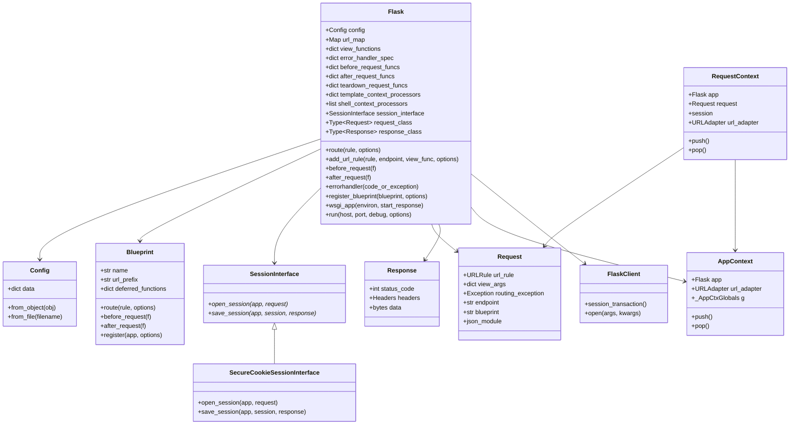
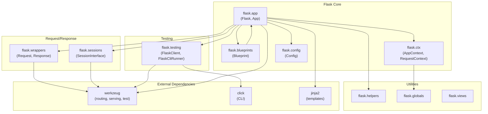
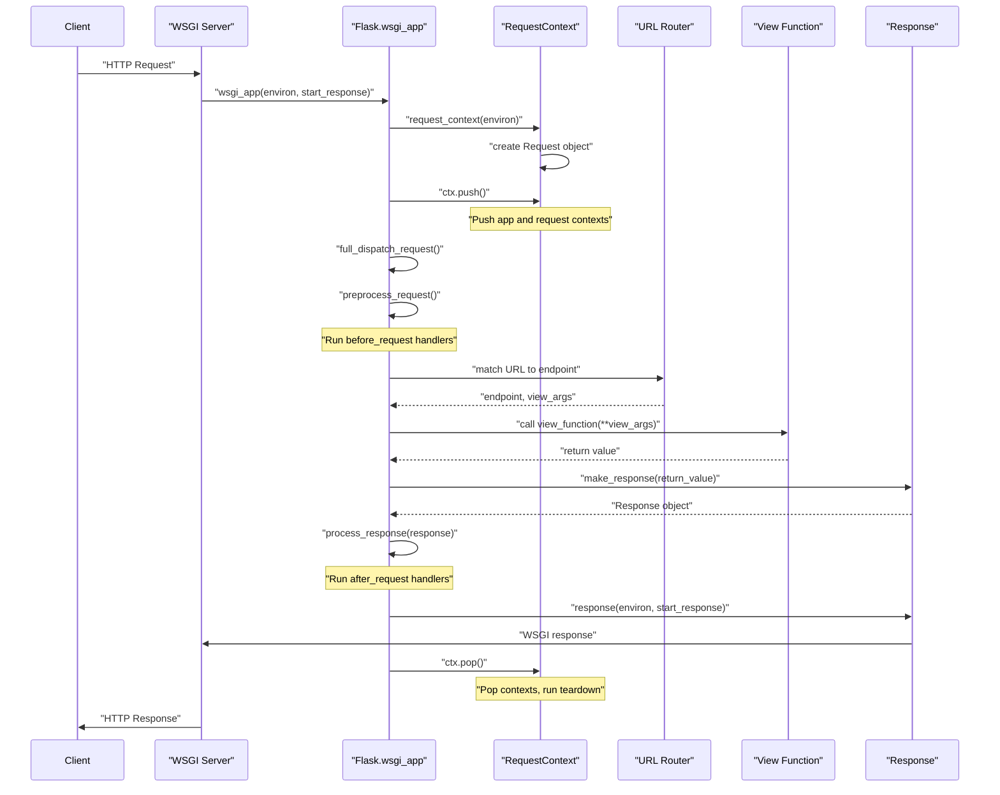

I'll help you generate UML diagrams for the Flask project based on the codebase context provided.

## UML Class Diagram

Based on the Flask core components, here's the class diagram showing the main classes and their relationships:

## Package Relationship Diagram

## Sequence Diagram - Request Processing Flow

