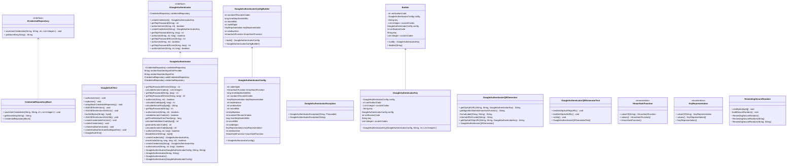

```mermaid
classDiagram
direction BT
class Builder {
  - int verificationCode
  - GoogleAuthenticatorConfig config
  - String key
  - List~Integer~ scratchCodes
   GoogleAuthenticatorConfig config
   int verificationCode
   String key
   List~Integer~ scratchCodes
  + build() GoogleAuthenticatorKey
  + Builder(String) 
}
class CredentialRepositoryMock {
  + saveUserCredentials(String, String, int, List~Integer~) void
  + getSecretKey(String) String
  + CredentialRepositoryMock() 
}
class GoogleAuthTest {
  + authoriseUser() void
  + authorise() void
  + setupMockCredentialRepository() void
  + rfc6238TestVectors() void
  + rfc6238TestVectorsSHA512() void
  - hexStr2Bytes(String) byte[]
  + rfc6238TestVectorsSHA256() void
  + createCredentialsForUser() void
  + createCredentials() void
  + createAndAuthenticate() void
  + createAndAuthenticateNullAlgorithm() void
  + GoogleAuthTest() 
}
class GoogleAuthenticator {
  - ICredentialRepository credentialRepository
   String randomNumberAlgorithmProvider
   String randomNumberAlgorithm
   ICredentialRepository validCredentialRepository
   ICredentialRepository credentialRepository
  + getTotpPasswordOfUser(String) int
  - calculateScratchCodes() List~Integer~
  + getTotpPassword(String, long) int
  + getTotpPasswordOfUser(String, long) int
  + authorize(String, int) boolean
  ~ calculateCode(byte[], long) int
  - calculateSecretKey(byte[]) String
  + getTotpPassword(String) int
  + authorizeUser(String, int) boolean
  ~ validateScratchCode(int) boolean
  - getTimeWindowFromTime(long) long
  - calculateValidationCode(byte[]) int
  - generateScratchCode() int
  - calculateScratchCode(byte[]) int
  + authorize(String, int, long) boolean
  - decodeSecret(String) byte[]
  + createCredentials() GoogleAuthenticatorKey
  - checkCode(String, long, long, int) boolean
  + createCredentials(String) GoogleAuthenticatorKey
  + authorizeUser(String, int, long) boolean
  + GoogleAuthenticator(GoogleAuthenticatorConfig, String, String) 
  + GoogleAuthenticator(String, String) 
  + GoogleAuthenticator() 
  + GoogleAuthenticator(GoogleAuthenticatorConfig) 
}
class GoogleAuthenticatorConfig {
  - int codeDigits
  - HmacHashFunction hmacHashFunction
  - long timeStepSizeInMillis
  - int numberOfScratchCodes
  - KeyRepresentation keyRepresentation
  - int keyModulus
  - int windowSize
  - int secretBits
   int keyModulus
   int numberOfScratchCodes
   long timeStepSizeInMillis
   int secretBits
   int codeDigits
   KeyRepresentation keyRepresentation
   int windowSize
   HmacHashFunction hmacHashFunction
  + GoogleAuthenticatorConfig() 
}
class GoogleAuthenticatorConfigBuilder {
   int numberOfScratchCodes
   long timeStepSizeInMillis
   int secretBits
   int codeDigits
   KeyRepresentation keyRepresentation
   int windowSize
   HmacHashFunction hmacHashFunction
  + build() GoogleAuthenticatorConfig
  + GoogleAuthenticatorConfigBuilder() 
}
class GoogleAuthenticatorException {
  + GoogleAuthenticatorException(String, Throwable) 
  + GoogleAuthenticatorException(String) 
}
class GoogleAuthenticatorKey {
  - GoogleAuthenticatorConfig config
  - int verificationCode
  - List~Integer~ scratchCodes
  - String key
   GoogleAuthenticatorConfig config
   int verificationCode
   String key
   List~Integer~ scratchCodes
  - GoogleAuthenticatorKey(GoogleAuthenticatorConfig, String, int, List~Integer~) 
}
class GoogleAuthenticatorQRGenerator {
  + getOtpAuthURL(String, String, GoogleAuthenticatorKey) String
  - getAlgorithmName(HmacHashFunction) String
  - formatLabel(String, String) String
  - internalURLEncode(String) String
  + getOtpAuthTotpURL(String, String, GoogleAuthenticatorKey) String
  + GoogleAuthenticatorQRGenerator() 
}
class GoogleAuthenticatorQRGeneratorTest {
  + testGetOtpAuthTotpURL() void
  + testGetOtpAuthURL() void
  + setUp() void
  + GoogleAuthenticatorQRGeneratorTest() 
}
class HmacHashFunction {
<<enumeration>>
  + valueOf(String) HmacHashFunction
  + values() HmacHashFunction[]
  + HmacHashFunction() 
}
class ICredentialRepository {
<<Interface>>
  + saveUserCredentials(String, String, int, List~Integer~) void
  + getSecretKey(String) String
}
class IGoogleAuthenticator {
<<Interface>>
   ICredentialRepository credentialRepository
  + createCredentials() GoogleAuthenticatorKey
  + getTotpPassword(String) int
  + authorizeUser(String, int) boolean
  + createCredentials(String) GoogleAuthenticatorKey
  + getTotpPassword(String, long) int
  + authorize(String, int, long) boolean
  + getTotpPasswordOfUser(String) int
  + authorize(String, int) boolean
  + getTotpPasswordOfUser(String, long) int
  + authorizeUser(String, int, long) boolean
}
class KeyRepresentation {
<<enumeration>>
  + valueOf(String) KeyRepresentation
  + values() KeyRepresentation[]
  + KeyRepresentation() 
}
class ReseedingSecureRandom {
  ~ nextBytes(byte[]) void
  - buildSecureRandom() void
  ~ ReseedingSecureRandom() 
  ~ ReseedingSecureRandom(String) 
  ~ ReseedingSecureRandom(String, String) 
}

GoogleAuthenticatorKey  -->  Builder 
CredentialRepositoryMock  ..>  ICredentialRepository 
GoogleAuthenticator  ..>  IGoogleAuthenticator 
GoogleAuthenticatorConfig  -->  GoogleAuthenticatorConfigBuilder 
```
