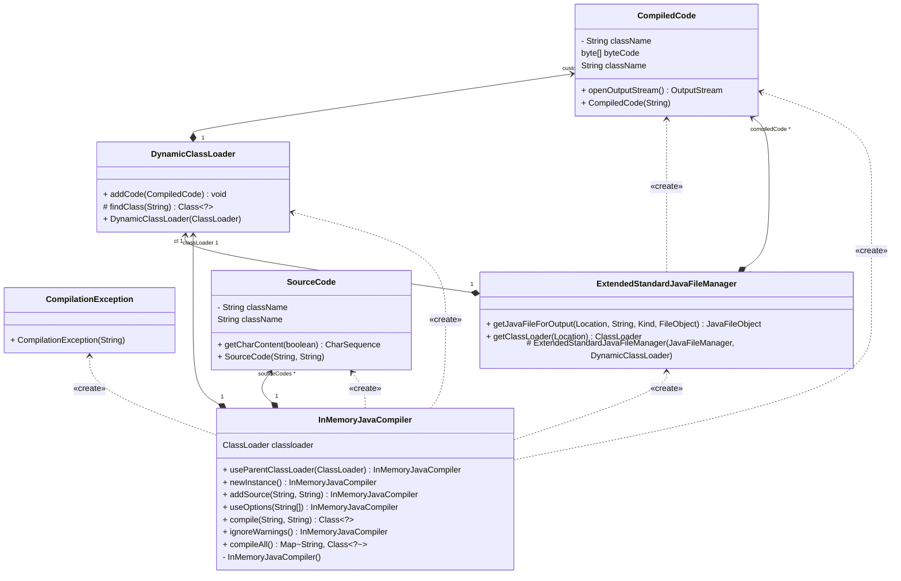

```mermaid
classDiagram
direction BT
class CompilationException {
  + CompilationException(String) 
}
class CompiledCode {
  - String className
   byte[] byteCode
   String className
  + openOutputStream() OutputStream
  + CompiledCode(String) 
}
class DynamicClassLoader {
  + addCode(CompiledCode) void
  # findClass(String) Class~?~
  + DynamicClassLoader(ClassLoader) 
}
class ExtendedStandardJavaFileManager {
  + getJavaFileForOutput(Location, String, Kind, FileObject) JavaFileObject
  + getClassLoader(Location) ClassLoader
  # ExtendedStandardJavaFileManager(JavaFileManager, DynamicClassLoader) 
}
class InMemoryJavaCompiler {
   ClassLoader classloader
  + useParentClassLoader(ClassLoader) InMemoryJavaCompiler
  + newInstance() InMemoryJavaCompiler
  + addSource(String, String) InMemoryJavaCompiler
  + useOptions(String[]) InMemoryJavaCompiler
  + compile(String, String) Class~?~
  + ignoreWarnings() InMemoryJavaCompiler
  + compileAll() Map~String, Class~?~~
  - InMemoryJavaCompiler() 
}
class SourceCode {
  - String className
   String className
  + getCharContent(boolean) CharSequence
  + SourceCode(String, String) 
}

DynamicClassLoader "1" *--> "customCompiledCode *" CompiledCode 
ExtendedStandardJavaFileManager  ..>  CompiledCode : «create»
ExtendedStandardJavaFileManager "1" *--> "compiledCode *" CompiledCode 
ExtendedStandardJavaFileManager "1" *--> "cl 1" DynamicClassLoader 
InMemoryJavaCompiler  ..>  CompilationException : «create»
InMemoryJavaCompiler  ..>  CompiledCode : «create»
InMemoryJavaCompiler "1" *--> "classLoader 1" DynamicClassLoader 
InMemoryJavaCompiler  ..>  DynamicClassLoader : «create»
InMemoryJavaCompiler  ..>  ExtendedStandardJavaFileManager : «create»
InMemoryJavaCompiler "1" *--> "sourceCodes *" SourceCode 
InMemoryJavaCompiler  ..>  SourceCode : «create»

```
