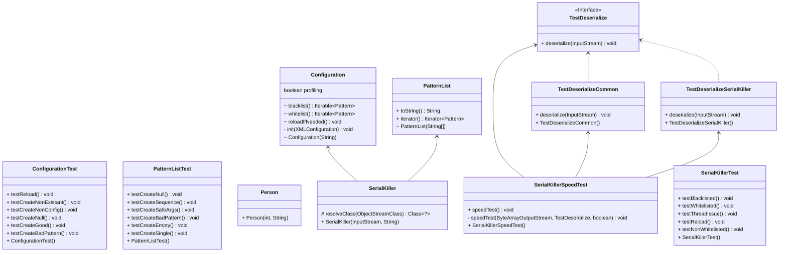

```mermaid
classDiagram
direction BT
class Configuration {
   boolean profiling
  ~ blacklist() Iterable~Pattern~
  ~ whitelist() Iterable~Pattern~
  ~ reloadIfNeeded() void
  - init(XMLConfiguration) void
  ~ Configuration(String) 
}
class ConfigurationTest {
  + testReload() void
  + testCreateNonExistant() void
  + testCreateNonConfig() void
  + testCreateNull() void
  + testCreateGood() void
  + testCreateBadPattern() void
  + ConfigurationTest() 
}
class PatternList {
  + toString() String
  + iterator() Iterator~Pattern~
  ~ PatternList(String[]) 
}
class PatternListTest {
  + testCreateNull() void
  + testCreateSequence() void
  + testCreateSafeArgs() void
  + testCreateBadPattern() void
  + testCreateEmpty() void
  + testCreateSingle() void
  + PatternListTest() 
}
class Person {
  + Person(int, String) 
}
class SerialKiller {
  # resolveClass(ObjectStreamClass) Class~?~
  + SerialKiller(InputStream, String) 
}
class SerialKillerSpeedTest {
  + speedTest() void
  - speedTest(ByteArrayOutputStream, TestDeserialize, boolean) void
  + SerialKillerSpeedTest() 
}
class SerialKillerTest {
  + testBlacklisted() void
  + testWhitelisted() void
  + testThreadIssue() void
  + testReload() void
  + testNonWhitelisted() void
  + SerialKillerTest() 
}
class TestDeserialize {
<<Interface>>
  + deserialize(InputStream) void
}
class TestDeserializeCommon {
  + deserialize(InputStream) void
  + TestDeserializeCommon() 
}
class TestDeserializeSerialKiller {
  + deserialize(InputStream) void
  + TestDeserializeSerialKiller() 
}

SerialKiller  -->  Configuration 
SerialKiller  -->  PatternList 
SerialKillerSpeedTest  -->  TestDeserialize 
SerialKillerSpeedTest  -->  TestDeserializeCommon 
TestDeserializeCommon  ..>  TestDeserialize 
SerialKillerSpeedTest  -->  TestDeserializeSerialKiller 
TestDeserializeSerialKiller  ..>  TestDeserialize 
```