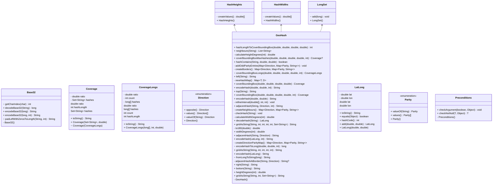

```mermaid
classDiagram
direction BT
class Base32 {
  ~ getCharIndex(char) int
  + decodeBase32(String) long
  + encodeBase32(long) String
  + encodeBase32(long, int) String
  ~ padLeftWithZerosToLength(String, int) String
  - Base32() 
}
class Coverage {
  - double ratio
  - Set~String~ hashes
   double ratio
   int hashLength
   Set~String~ hashes
  + toString() String
  + Coverage(Set~String~, double) 
  ~ Coverage(CoverageLongs) 
}
class CoverageLongs {
  - double ratio
  - int count
  - long[] hashes
   double ratio
   long[] hashes
   int count
   int hashLength
  + toString() String
  + CoverageLongs(long[], int, double) 
}
class Direction {
<<enumeration>>
  + opposite() Direction
  + values() Direction[]
  + valueOf(String) Direction
  + Direction() 
}
class GeoHash {
  + hashLengthToCoverBoundingBox(double, double, double, double) int
  + neighbours(String) List~String~
  - calculateHeightDegrees(int) double
  + coverBoundingBoxMaxHashes(double, double, double, double, int) Coverage?
  + hashContains(String, double, double) boolean
  - addOddParityEntries(Map~Direction, Map~Parity, String~~) void
  - createBorders() Map~Direction, Map~Parity, String~~
  ~ coverBoundingBoxLongs(double, double, double, double, int) CoverageLongs
  + left(String) String
  - newHashMap() Map~T, D~
  + coverBoundingBox(double, double, double, double) Coverage
  + encodeHash(double, double, int) String
  + top(String) String
  + coverBoundingBox(double, double, double, double, int) Coverage
  + encodeHash(double, double) String
  - refineInterval(double[], int, int) void
  + adjacentHash(String, Direction, int) String
  - createNeighbours() Map~Direction, Map~Parity, String~~
  - checkHash(String) void
  - calculateWidthDegrees(int) double
  + decodeHash(String) LatLong
  + gridAsString(String, int, int, int, int, Set~String~) String
  - to180(double) double
  + widthDegrees(int) double
  + adjacentHash(String, Direction) String
  + encodeHash(LatLong, int) String
  - createDirectionParityMap() Map~Direction, Map~Parity, String~~
  ~ encodeHashToLong(double, double, int) long
  + gridAsString(String, int, int, int, int) String
  + encodeHash(LatLong) String
  ~ fromLongToString(long) String
  - adjacentHashAtBorder(String, Direction) String?
  + right(String) String
  + bottom(String) String
  + heightDegrees(int) double
  + gridAsString(String, int, Set~String~) String
  - GeoHash() 
}
class HashHeights {
  - createValues() double[]
  + HashHeights() 
}
class HashWidths {
  - createValues() double[]
  + HashWidths() 
}
class LatLong {
  - double lat
  - double lon
   double lat
   double lon
  + toString() String
  + equals(Object) boolean
  + hashCode() int
  + add(double, double) LatLong
  + LatLong(double, double) 
}
class LongSet {
  ~ add(long) void
  + LongSet() 
}
class Parity {
<<enumeration>>
  + valueOf(String) Parity
  + values() Parity[]
  + Parity() 
}
class Preconditions {
  + checkArgument(boolean, Object) void
  + checkNotNull(T, Object) T
  - Preconditions() 
}

GeoHash  -->  HashHeights 
GeoHash  -->  HashWidths 
GeoHash  -->  LongSet 
```