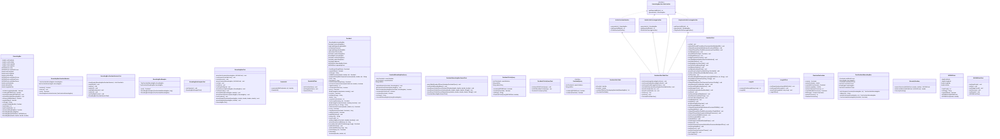

```mermaid
classDiagram
direction BT
class ALittleTooSmallVerifier {
  + generate(int) BoundingBox
  + getExpectedBits(int) int
  + ALittleTooSmallVerifier() 
}
class BothALittleTooLargeVerifier {
  + generate(int) BoundingBox
  + getExpectedBits(int) int
  + BothALittleTooLargeVerifier() 
}
class BoundingBox {
  - double northLatitude
  - double southLatitude
  - double westLongitude
  - double eastLongitude
   WGS84Point center
   WGS84Point northEastCorner
   double eastLongitude
   double westLongitude
   double northLatitude
   WGS84Point southWestCorner
   WGS84Point southEastCorner
   WGS84Point northWestCorner
   double southLatitude
   double latitudeSize
   double longitudeSize
  - containsLongitude(double) boolean
  + contains(WGS84Point) boolean
  + expandToInclude(WGS84Point) void
  + expandToInclude(BoundingBox) void
  + intersects180Meridian() boolean
  + equals(Object) boolean
  + toString() String
  - containsLatitude(double) boolean
  + hashCode() int
  - hashCode(double) int
  + intersects(BoundingBox) boolean
  + BoundingBox(BoundingBox) 
  + BoundingBox(WGS84Point, WGS84Point) 
  + BoundingBox(double, double, double, double) 
}
class BoundingBoxGeoHashIterator {
  - TwoGeoHashBoundingBox boundingBox
   TwoGeoHashBoundingBox boundingBox
  + hasNext() boolean
  + remove() void
  + next() GeoHash
  + BoundingBoxGeoHashIterator(TwoGeoHashBoundingBox) 
}
class BoundingBoxGeoHashIteratorTest {
  - checkIterator(BoundingBoxGeoHashIterator) List~GeoHash~
  + testAllCells() void
  + testIter() void
  + testIter2() void
  + testEndlessIterator() void
  + testIter3() void
  + testTopRightCorner() void
  + BoundingBoxGeoHashIteratorTest() 
}
class BoundingBoxSampler {
  - TwoGeoHashBoundingBox boundingBox
   TwoGeoHashBoundingBox boundingBox
  + next() GeoHash
  + BoundingBoxSampler(TwoGeoHashBoundingBox, long) 
  + BoundingBoxSampler(TwoGeoHashBoundingBox) 
}
class BoundingBoxSamplerTest {
  + testSampler() void
  + BoundingBoxSamplerTest() 
}
class BoundingBoxSizeTableVerifier {
<<Interface>>
  + getExpectedBits(int) int
  + generate(int) BoundingBox
}
class BoundingBoxTest {
  - assertNotContains(BoundingBox, WGS84Point) void
  + testExpandToIncludePoint() void
  + testIntersects() void
  - assertContains(BoundingBox, WGS84Point) void
  + setUp() void
  + testSize() void
  + testEqualsObject() void
  - assertIntersects(BoundingBox, BoundingBox) void
  + testHashCode() void
  - assertWidthIs(BoundingBox, double) void
  - assertDoesNotIntersect(BoundingBox, BoundingBox) void
  + testContains() void
  - assertExpandToInclude(BoundingBox, double, double, double, double) void
  - assertHeightIs(BoundingBox, double) void
  + BoundingBoxTest() 
}
class DoubleUtil {
  + remainderWithFix(double, int) double
  + DoubleUtil() 
}
class DoubleUtilTest {
  + testPositiveValue() void
  + testNegativeValue() void
  + DoubleUtilTest() 
}
class GeoHash {
  - BoundingBox boundingBox
   GeoHash westernNeighbour
   long[] rightAlignedLongitudeBits
   int characterPrecision
   long[] rightAlignedLatitudeBits
   int[] numberOfLatLonBits
   GeoHash southernNeighbour
   BoundingBox boundingBox
   GeoHash northernNeighbour
   GeoHash easternNeighbour
   GeoHash[] adjacent
   WGS84Point boundingBoxCenter
   WGS84Point originatingPoint
  + fromBinaryString(String) GeoHash
  + equals(Object) boolean
  + toString() String
  + withBitPrecision(double, double, int) GeoHash
  + geoHashStringWithCharacterPrecision(double, double, int) String
  + ord() long
  + longValue() long
  + fromGeohashString(String) GeoHash
  + enclosesCircleAroundPoint(WGS84Point, double) boolean
  + significantBits() int
  + contains(WGS84Point) boolean
  + prev() GeoHash
  - divideRangeEncode(double, double[]) void
  + next(int) GeoHash
  + toBinaryString() String
  - mask() long
  + compareTo(GeoHash) int
  + fromLongValue(long, int) GeoHash
  - divideRangeDecode(GeoHash, double[], boolean) void
  - padLeft(String, int, String) String
  + withCharacterPrecision(double, double, int) GeoHash
  + next() GeoHash
  + stepsBetween(GeoHash, GeoHash) long
  + within(GeoHash) boolean
  # addOffBitToEnd() void
  + toBase32() String
  + hashCode() int
  - setBoundingBox(GeoHash, double[], double[]) void
  - extractEverySecondBit(long, int) long
  # recombineLatLonBitsToHash(long[], long[]) GeoHash
  # addOnBitToEnd() void
  - maskLastNBits(long, long) long
  + fromOrd(long, int) GeoHash
  # GeoHash() 
  - GeoHash(double, double, int) 
}
class GeoHashBoundingBoxQuery {
  - List~GeoHash~ searchHashes
   List~GeoHash~ searchHashes
   String wktBox
  - expandSearch(GeoHash, BoundingBox) void
  - generateSearchHashes(BoundingBox) void
  - hashContainsBoundingBox(GeoHash, BoundingBox) boolean
  + contains(WGS84Point) boolean
  + contains(GeoHash) boolean
  + toString() String
  + GeoHashBoundingBoxQuery(BoundingBox) 
}
class GeoHashBoundingBoxSearchTest {
  - assertRightNumberOfSearchHashes(GeoHashQuery) void
  + testSeveralBoundingBoxes() void
  - checkSearchYieldsCorrectNumberOfHashes(double, double, double, double) void
  - checkSearchYieldsCorrectHashes(double, double, double, double, String[]) void
  - checkSearchYieldsCorrectBinaryHashes(double, double, double, double, String[]) void
  + GeoHashBoundingBoxSearchTest() 
}
class GeoHashCircleQuery {
   List~GeoHash~ searchHashes
   String wktBox
   String radiusString
  + contains(WGS84Point) boolean
  + contains(GeoHash) boolean
  + toString() String
  + GeoHashCircleQuery(WGS84Point, double) 
}
class GeoHashCircleQueryTest {
  + testIssue3WithCircleQuery() void
  + test180MeridianCircleQuery() void
  + GeoHashCircleQueryTest() 
}
class GeoHashQuery {
<<Interface>>
   List~GeoHash~ searchHashes
   String wktBox
  + contains(WGS84Point) boolean
  + contains(GeoHash) boolean
}
class GeoHashSizeTable {
  # dLon(int) double
  # dLat(int) double
  + numberOfBitsForOverlappingGeoHash(BoundingBox) int
  + GeoHashSizeTable() 
}
class GeoHashSizeTableTest {
  + testKnownLargerBoundingBoxSizes() void
  + testKnownSmallerBoundingBoxSizes() void
  + testKnownOneBitLargerBoxSizes() void
  - checkWithGenerator(BoundingBoxSizeTableVerifier) void
  - assertDLatIs(double, int) void
  - assertDLonIs(double, int) void
  + testDLon() void
  + testDLat() void
  + GeoHashSizeTableTest() 
}
class GeoHashTest {
  + setUp() void
  + toBase32ShouldThrowWhenPrecisionIsNotAMultipleOf5() void
  + itShouldCreateAHashWithMinimumPrecisionOf0Bits() void
  + itShouldThrowWhenTheBitPrecisionIsLessThan0Bits() void
  + testAddingZeroes() void
  - assertWithin(GeoHash, GeoHash) void
  + testStepsBetween() void
  + testByCharacterPrecision() void
  + testThatAdjacentHashesHavePointInitialized() void
  + testOrdIsPositive() void
  + testNeighbourLocationCode() void
  + testToAndFromBinaryString() void
  + testAdjacentHashes() void
  + testEqualsAndHashCode() void
  - assertArrayContainsGeoHash(String, GeoHash[]) void
  + testSecondCaseWhereOrdMustBePositive() void
  + testDecode() void
  - assertEncodingWithCharacterPrecision(WGS84Point, int, String) void
  - assertAdjacentHashesAre(String, String[]) void
  + testToBase32() void
  + itShouldThrowWhenTheCharacterPrecisionIsTooBig() void
  - checkMovingInCircle(double, double) void
  + testKnownNeighbouringHashes() void
  + testMovingInCircle() void
  + testNeibouringHashesNearMeridian() void
  + testNext() void
  + testKnownAdjacentNeighbours() void
  - checkMoveAroundStrip(String) void
  + testLatLonBoundingBoxes() void
  + testAddingOnes() void
  + testWithin() void
  - printBoundingBox(GeoHash) void
  + testToLongAndBack() void
  + itShouldCreateAHashWithMaximumPrecisionOf64Bits() void
  + testSimpleWithin() void
  + itShouldThrowWhenTheBitPrecisionIsMoreThan64Bits() void
  + itShouldThrowANiceExceptionOnIllegalCharacters() void
  + testConstructorWithBitPrecision() void
  + testGetLongitudeBits() void
  + testNotWithin() void
  + testMovingAroundWorldOnHashStrips() void
  + testIssue1() void
  + testGetCharacterPrecisionWorksWhenPrecisionIsMultipleOfFive() void
  + testGetLatitudeBits() void
  + testNextPrev() void
  + testGetCharacterPrecisionThrows() void
  + testCompareTo() void
  + GeoHashTest() 
}
class LongUtil {
  + commonPrefixLength(long, long) int
  + LongUtil() 
}
class LongUtilTest {
  + testSameNumbersHave64BitsPrefix() void
  + testKnownPrefixLenghts() void
  - assertPrefixLength(int, long, long) void
  + LongUtilTest() 
}
class OnlyOneALittleTooLargeVerifier {
  + getExpectedBits(int) int
  + generate(int) BoundingBox
  + OnlyOneALittleTooLargeVerifier() 
}
class RandomGeohashes {
  + create() GeoHash
  - randomLatitude() double
  + createWithPrecision(int) GeoHash
  - randomLongitude() double
  - randomCharacterPrecision() int
  + createWith5BitsPrecision() GeoHash
  + fullRange() Iterable~GeoHash~
  - randomPrecision() int
  + RandomGeohashes() 
}
class TwoGeoHashBoundingBox {
  - GeoHash northEastCorner
  - BoundingBox boundingBox
  - GeoHash southWestCorner
   GeoHash northEastCorner
   BoundingBox boundingBox
   GeoHash southWestCorner
  + withCharacterPrecision(BoundingBox, int) TwoGeoHashBoundingBox
  + toBase32() String
  + withBitPrecision(BoundingBox, int) TwoGeoHashBoundingBox
  + TwoGeoHashBoundingBox(GeoHash, GeoHash) 
}
class VincentyGeodesy {
  + moveInDirection(WGS84Point, double, double) WGS84Point
  + distanceInMeters(WGS84Point, WGS84Point) double
  + VincentyGeodesy() 
}
class WGS84Point {
  - double latitude
  - double longitude
   double longitude
   double latitude
  + hashCode() int
  + toString() String
  + equals(Object) boolean
  + WGS84Point(WGS84Point) 
  + WGS84Point(double, double) 
}
class WGS84PointTest {
  + testHashCode() void
  + setUp() void
  + testRangeCheck() void
  + testVincenty() void
  + testEquals() void
  + WGS84PointTest() 
}

ALittleTooSmallVerifier  ..>  BoundingBoxSizeTableVerifier 
GeoHashSizeTableTest  -->  ALittleTooSmallVerifier 
BothALittleTooLargeVerifier  ..>  BoundingBoxSizeTableVerifier 
GeoHashSizeTableTest  -->  BothALittleTooLargeVerifier 
GeoHashSizeTableTest  -->  BoundingBoxSizeTableVerifier 
OnlyOneALittleTooLargeVerifier  ..>  BoundingBoxSizeTableVerifier 
GeoHashSizeTableTest  -->  OnlyOneALittleTooLargeVerifier 

```