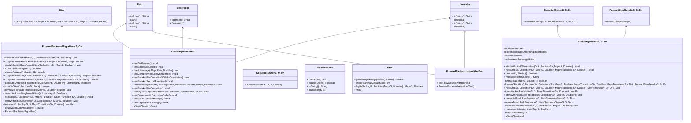

```mermaid
classDiagram
direction BT
class Descriptor {
  + toString() String
  + Descriptor() 
}
class ExtendedState~S, O, D~ {
  ~ ExtendedState(S, ExtendedState~S, O, D~, O, D) 
}
class ForwardBackwardAlgorithm~S, O~ {
  - initializeStateProbabilities(O, Collection~S~, Map~S, Double~) void
  - computeUnscaledBackwardProbability(S, Map~S, Double~, Step) double
  + startWithInitialStateProbabilities(Collection~S~, Map~S, Double~) void
  + forwardProbability(int, S) double
  + currentForwardProbability(S) double
  - computeSmoothingProbabilitiesVector(Collection~S~, Map~S, Double~, Map~S, Double~) Map~S, Double~
  - computeForwardProbability(S, Map~S, Double~, Map~S, Double~, Map~Transition~S~, Double~) double
  ~ computeSmoothingProbabilities(List~Map~S, Double~~) List~Map~S, Double~~
  - sumsToOne(Collection~Double~) boolean
  - normalizeForwardProbabilities(Map~S, Double~, double) void
  + computeSmoothingProbabilities() List~Map~S, Double~~
  + nextStep(O, Collection~S~, Map~S, Double~, Map~Transition~S~, Double~) void
  + startWithInitialObservation(O, Collection~S~, Map~S, Double~) void
  - transitionProbability(S, S, Map~Transition~S~, Double~) double
  + observationLogProbability() double
  + ForwardBackwardAlgorithm() 
}
class ForwardBackwardAlgorithmTest {
  + testForwardBackward() void
  + ForwardBackwardAlgorithmTest() 
}
class ForwardStepResult~S, O, D~ {
  ~ ForwardStepResult(int) 
}
class Rain {
  + toString() String
  + Rain() 
}
class Rain {
  + toString() String
  + Rain() 
}
class SequenceState~S, O, D~ {
  + SequenceState(S, O, D, Double) 
}
class Step {
  ~ Step(Collection~S~, Map~S, Double~, Map~Transition~S~, Double~, Map~S, Double~, double) 
}
class Transition~S~ {
  + hashCode() int
  + equals(Object) boolean
  + toString() String
  + Transition(S, S) 
}
class Umbrella {
  + toString() String
  + Umbrella() 
}
class Umbrella {
  + toString() String
  + Umbrella() 
}
class Utils {
  ~ probabilityInRange(double, double) boolean
  ~ initialHashMapCapacity(int) int
  ~ logToNonLogProbabilities(Map~S, Double~) Map~S, Double~
  + Utils() 
}
class ViterbiAlgorithm~S, O, D~ {
  - boolean isBroken
   boolean computeSmoothingProbabilities
   boolean isBroken
   boolean keepMessageHistory
  + startWithInitialObservation(O, Collection~S~, Map~S, Double~) void
  + nextStep(O, Collection~S~, Map~S, Double~, Map~Transition~S~, Double~) void
  + processingStarted() boolean
  + messageHistoryString() String
  - hmmBreak(Map~S, Double~) boolean
  - forwardStep(O, Collection~S~, Collection~S~, Map~S, Double~, Map~S, Double~, Map~Transition~S~, Double~, Map~Transition~S~, D~) ForwardStepResult~S, O, D~
  + nextStep(O, Collection~S~, Map~S, Double~, Map~Transition~S~, Double~, Map~Transition~S~, D~) void
  - transitionLogProbability(S, S, Map~Transition~S~, Double~) double
  + startWithInitialStateProbabilities(Collection~S~, Map~S, Double~) void
  + computeMostLikelySequence() List~SequenceState~S, O, D~~
  - retrieveMostLikelySequence() List~SequenceState~S, O, D~~
  - initializeStateProbabilities(O, Collection~S~, Map~S, Double~) void
  + messageHistory() List~Map~S, Double~~
  - mostLikelyState() S
  + ViterbiAlgorithm() 
}
class ViterbiAlgorithmTest {
  + testSetParams() void
  + testEmptySequence() void
  - checkMessage(Map~Rain, Double~, Map~Rain, Double~) void
  + testComputeMostLikelySequence() void
  + testBreakAtFirstTransitionWithNoCandidates() void
  + testBreakAtSecondTransition() void
  - checkMessageHistory(List~Map~Rain, Double~~, List~Map~Rain, Double~~) void
  + testBreakAtFirstTransition() void
  - states(List~SequenceState~Rain, Umbrella, Descriptor~~) List~Rain~
  + testDeterministicCandidateOrder() void
  + testBreakAtInitialMessage() void
  + testEmptyInitialMessage() void
  + ViterbiAlgorithmTest() 
}

ViterbiAlgorithmTest  -->  Descriptor 
ViterbiAlgorithm~S, O, D~  -->  ExtendedState~S, O, D~ 
ViterbiAlgorithm~S, O, D~  -->  ForwardStepResult~S, O, D~ 
ForwardBackwardAlgorithmTest  -->  Rain 
ViterbiAlgorithmTest  -->  Rain 
ForwardBackwardAlgorithm~S, O~  -->  Step 
ForwardBackwardAlgorithmTest  -->  Umbrella 
ViterbiAlgorithmTest  -->  Umbrella 

```