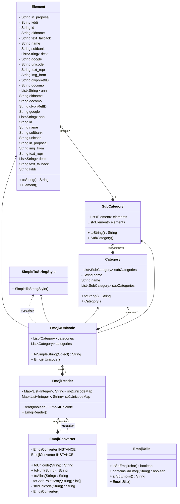

```mermaid
classDiagram
direction BT
class Category {
  - List~SubCategory~ subCategories
  - String name
   String name
   List~SubCategory~ subCategories
  + toString() String
  + Category() 
}
class Element {
  - String in_proposal
  - String kddi
  - String id
  - String oldname
  - String text_fallback
  - String name
  - String softbank
  - List~String~ desc
  - String google
  - String unicode
  - String text_repr
  - String img_from
  - String glyphRefID
  - String docomo
  - List~String~ ann
   String oldname
   String docomo
   String glyphRefID
   String google
   List~String~ ann
   String id
   String name
   String softbank
   String unicode
   String in_proposal
   String img_from
   String text_repr
   List~String~ desc
   String text_fallback
   String kddi
  + toString() String
  + Element() 
}
class Emoji4Unicode {
  - List~Category~ categories
   List~Category~ categories
  + toSimpleString(Object) String
  + Emoji4Unicode() 
}
class EmojiConverter {
  - EmojiConverter INSTANCE
   EmojiConverter INSTANCE
  + toUnicode(String) String
  + toHtml(String) String
  + toAlias(String) String
  - toCodePointArray(String) int[]
  - sb2Unicode(String) String
  - EmojiConverter() 
}
class EmojiReader {
  - Map~List~Integer~, String~ sb2UnicodeMap
   Map~List~Integer~, String~ sb2UnicodeMap
  ~ read(boolean) Emoji4Unicode
  + EmojiReader() 
}
class EmojiUtils {
  + isSbEmoji(char) boolean
  + containsSbEmoji(String) boolean
  + allSbEmojis() String
  + EmojiUtils() 
}
class SimpleToStringStyle {
  + SimpleToStringStyle() 
}
class SubCategory {
  - List~Element~ elements
   List~Element~ elements
  + toString() String
  + SubCategory() 
}

Emoji4Unicode  -->  Category 
Category "1" *--> "subCategories *" SubCategory 
Emoji4Unicode  -->  Element 
Emoji4Unicode "1" *--> "categories *" Category 
Emoji4Unicode  ..>  SimpleToStringStyle : «create»
EmojiConverter "1" *--> "emojiReader 1" EmojiReader 
EmojiConverter  ..>  EmojiReader : «create»
EmojiReader "1" *--> "emoji 1" Emoji4Unicode 
Emoji4Unicode  -->  SimpleToStringStyle 
SubCategory "1" *--> "elements *" Element 
Emoji4Unicode  -->  SubCategory 

```
