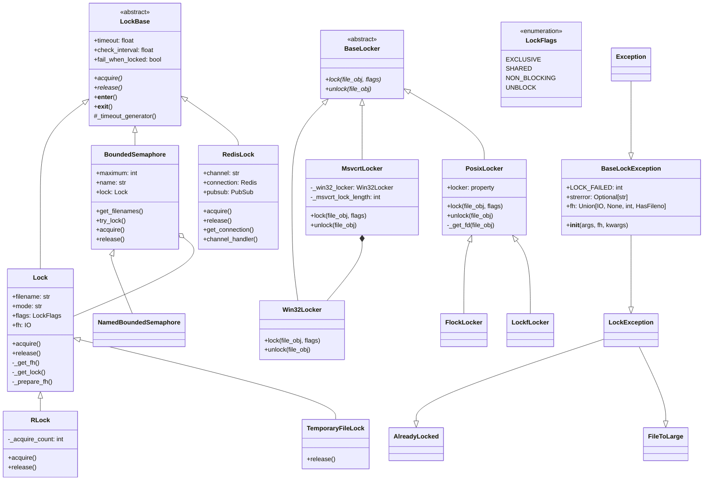
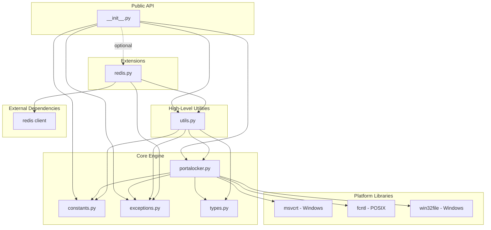
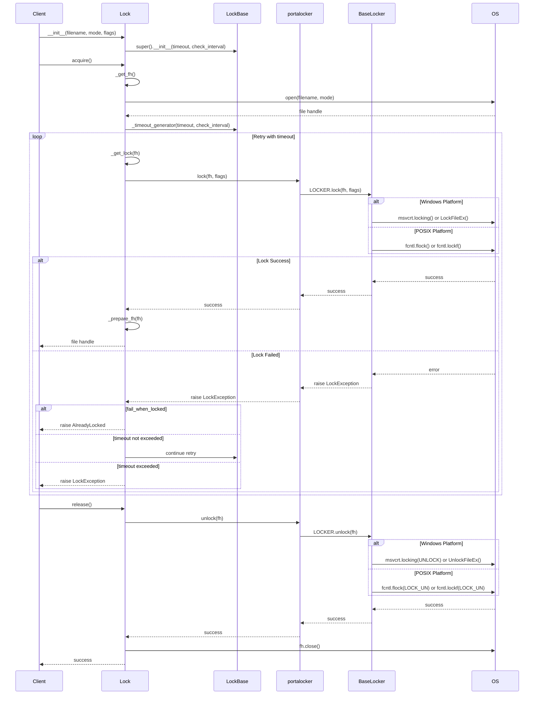

## Class Diagram

The portalocker library has a clear class hierarchy centered around file locking abstractions:

```mermaid
classDiagram
    class BaseLockException {
        +LOCK_FAILED: int
        +strerror: Optional[str]
        +fh: Union[IO, None, int, HasFileno]
        +__init__(args, fh, kwargs)
    }
    
    class LockException {
    }
    
    class AlreadyLocked {
    }
    
    class FileToLarge {
    }
    
    class BaseLocker {
        <<abstract>>
        +lock(file_obj, flags)*
        +unlock(file_obj)*
    }
    
    class Win32Locker {
        +lock(file_obj, flags)
        +unlock(file_obj)
    }
    
    class MsvcrtLocker {
        -_win32_locker: Win32Locker
        -_msvcrt_lock_length: int
        +lock(file_obj, flags)
        +unlock(file_obj)
    }
    
    class PosixLocker {
        +locker: property
        +lock(file_obj, flags)
        +unlock(file_obj)
        -_get_fd(file_obj)
    }
    
    class FlockLocker {
    }
    
    class LockfLocker {
    }
    
    class LockBase {
        <<abstract>>
        +timeout: float
        +check_interval: float
        +fail_when_locked: bool
        +acquire()*
        +release()*
        +__enter__()
        +__exit__()
        #_timeout_generator()
    }
    
    class Lock {
        +filename: str
        +mode: str
        +flags: LockFlags
        +fh: IO
        +acquire()
        +release()
        -_get_fh()
        -_get_lock()
        -_prepare_fh()
    }
    
    class RLock {
        -_acquire_count: int
        +acquire()
        +release()
    }
    
    class TemporaryFileLock {
        +release()
    }
    
    class BoundedSemaphore {
        +maximum: int
        +name: str
        +lock: Lock
        +get_filenames()
        +try_lock()
        +acquire()
        +release()
    }
    
    class NamedBoundedSemaphore {
    }
    
    class RedisLock {
        +channel: str
        +connection: Redis
        +pubsub: PubSub
        +acquire()
        +release()
        +get_connection()
        +channel_handler()
    }
    
    class LockFlags {
        <<enumeration>>
        EXCLUSIVE
        SHARED
        NON_BLOCKING
        UNBLOCK
    }
    
    Exception --|> BaseLockException
    BaseLockException --|> LockException
    LockException --|> AlreadyLocked
    LockException --|> FileToLarge
    
    BaseLocker <|-- Win32Locker
    BaseLocker <|-- MsvcrtLocker
    BaseLocker <|-- PosixLocker
    PosixLocker <|-- FlockLocker
    PosixLocker <|-- LockfLocker
    
    MsvcrtLocker *-- Win32Locker
    
    LockBase <|-- Lock
    LockBase <|-- BoundedSemaphore
    LockBase <|-- RedisLock
    Lock <|-- RLock
    Lock <|-- TemporaryFileLock
    BoundedSemaphore <|-- NamedBoundedSemaphore
    
    BoundedSemaphore o-- Lock
```

## Package Relationship Diagram

```mermaid
graph TD
    subgraph "Public API"
        A[__init__.py]
    end
    
    subgraph "Core Engine"
        B[portalocker.py]
        C[constants.py]
        D[exceptions.py]
        E[types.py]
    end
    
    subgraph "High-Level Utilities"
        F[utils.py]
    end
    
    subgraph "Extensions"
        G[redis.py]
    end
    
    subgraph "Platform Libraries"
        H[msvcrt - Windows]
        I[fcntl - POSIX]
        J[win32file - Windows]
    end
    
    subgraph "External Dependencies"
        K[redis client]
    end
    
    A --> B
    A --> C
    A --> D
    A --> F
    A -.optional.-> G
    
    B --> C
    B --> D
    B --> E
    B --> H
    B --> I
    B --> J
    
    F --> B
    F --> C
    F --> D
    F --> E
    
    G --> F
    G --> D
    G --> K
```

## Sequence Diagram - File Lock Acquisition

```mermaid
sequenceDiagram
    participant Client
    participant Lock
    participant LockBase
    participant portalocker
    participant BaseLocker
    participant OS
    
    Client->>Lock: __init__(filename, mode, flags)
    Lock->>LockBase: super().__init__(timeout, check_interval)
    
    Client->>Lock: acquire()
    Lock->>Lock: _get_fh()
    Lock->>OS: open(filename, mode)
    OS-->>Lock: file handle
    
    Lock->>LockBase: _timeout_generator(timeout, check_interval)
    
    loop Retry with timeout
        Lock->>Lock: _get_lock(fh)
        Lock->>portalocker: lock(fh, flags)
        portalocker->>BaseLocker: LOCKER.lock(fh, flags)
        
        alt Windows Platform
            BaseLocker->>OS: msvcrt.locking() or LockFileEx()
        else POSIX Platform
            BaseLocker->>OS: fcntl.flock() or fcntl.lockf()
        end
        
        alt Lock Success
            OS-->>BaseLocker: success
            BaseLocker-->>portalocker: success
            portalocker-->>Lock: success
            Lock->>Lock: _prepare_fh(fh)
            Lock-->>Client: file handle
        else Lock Failed
            OS-->>BaseLocker: error
            BaseLocker-->>portalocker: raise LockException
            portalocker-->>Lock: raise LockException
            
            alt fail_when_locked
                Lock-->>Client: raise AlreadyLocked
            else timeout not exceeded
                Lock->>LockBase: continue retry
            else timeout exceeded
                Lock-->>Client: raise LockException
            end
        end
    end
    
    Client->>Lock: release()
    Lock->>portalocker: unlock(fh)
    portalocker->>BaseLocker: LOCKER.unlock(fh)
    
    alt Windows Platform
        BaseLocker->>OS: msvcrt.locking(UNLOCK) or UnlockFileEx()
    else POSIX Platform
        BaseLocker->>OS: fcntl.flock(LOCK_UN) or fcntl.lockf(LOCK_UN)
    end
    
    OS-->>BaseLocker: success
    BaseLocker-->>portalocker: success
    portalocker-->>Lock: success
    Lock->>OS: fh.close()
    Lock-->>Client: success
```