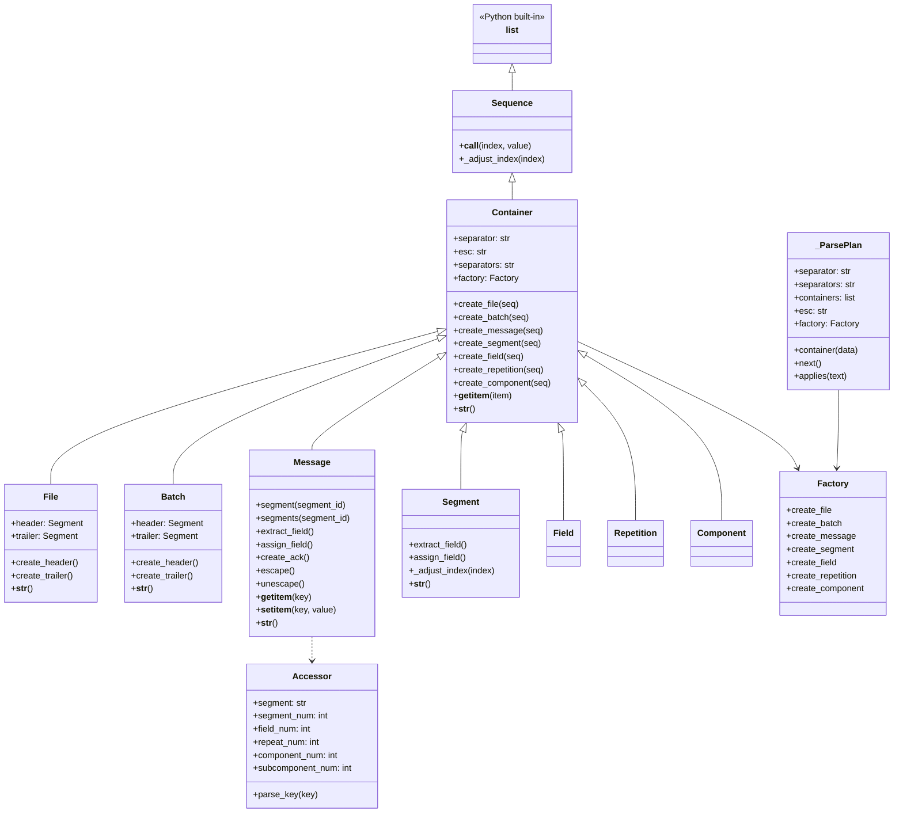
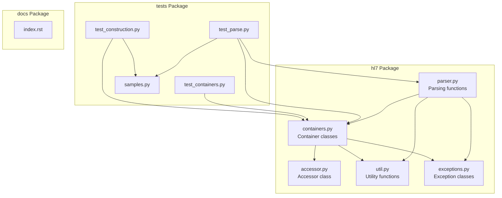
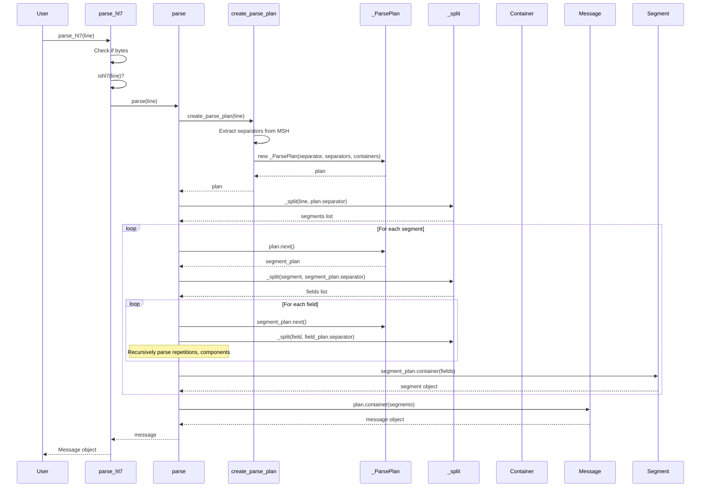

## UML Class Diagram

```mermaid
classDiagram
    class list {
        <<Python built-in>>
    }
    
    class Sequence {
        +__call__(index, value)
        +_adjust_index(index)
    }
    
    class Container {
        +separator: str
        +esc: str
        +separators: str
        +factory: Factory
        +create_file(seq)
        +create_batch(seq)
        +create_message(seq)
        +create_segment(seq)
        +create_field(seq)
        +create_repetition(seq)
        +create_component(seq)
        +__getitem__(item)
        +__str__()
    }
    
    class File {
        +header: Segment
        +trailer: Segment
        +create_header()
        +create_trailer()
        +__str__()
    }
    
    class Batch {
        +header: Segment
        +trailer: Segment
        +create_header()
        +create_trailer()
        +__str__()
    }
    
    class Message {
        +segment(segment_id)
        +segments(segment_id)
        +extract_field()
        +assign_field()
        +create_ack()
        +escape()
        +unescape()
        +__getitem__(key)
        +__setitem__(key, value)
        +__str__()
    }
    
    class Segment {
        +extract_field()
        +assign_field()
        +_adjust_index(index)
        +__str__()
    }
    
    class Field {
    }
    
    class Repetition {
    }
    
    class Component {
    }
    
    class Factory {
        +create_file
        +create_batch
        +create_message
        +create_segment
        +create_field
        +create_repetition
        +create_component
    }
    
    class Accessor {
        +segment: str
        +segment_num: int
        +field_num: int
        +repeat_num: int
        +component_num: int
        +subcomponent_num: int
        +parse_key(key)
    }
    
    class _ParsePlan {
        +separator: str
        +separators: str
        +containers: list
        +esc: str
        +factory: Factory
        +container(data)
        +next()
        +applies(text)
    }
    
    list <|-- Sequence
    Sequence <|-- Container
    Container <|-- File
    Container <|-- Batch
    Container <|-- Message
    Container <|-- Segment
    Container <|-- Field
    Container <|-- Repetition
    Container <|-- Component
    Container --> Factory
    Message ..> Accessor
    _ParsePlan --> Factory
```

## UML Package Diagram

```mermaid
graph TB
    subgraph "hl7 Package"
        containers["containers.py<br/>Container classes"]
        parser["parser.py<br/>Parsing functions"]
        accessor["accessor.py<br/>Accessor class"]
        util["util.py<br/>Utility functions"]
        exceptions["exceptions.py<br/>Exception classes"]
    end
    
    subgraph "tests Package"
        test_parse["test_parse.py"]
        test_containers["test_containers.py"]
        test_construction["test_construction.py"]
        samples["samples.py"]
    end
    
    subgraph "docs Package"
        index["index.rst"]
    end
    
    parser --> containers
    parser --> exceptions
    parser --> util
    containers --> accessor
    containers --> exceptions
    containers --> util
    
    test_parse --> containers
    test_parse --> parser
    test_parse --> samples
    test_containers --> containers
    test_construction --> containers
    test_construction --> samples
```

## UML Sequence Diagram

```mermaid
sequenceDiagram
    participant User
    participant parse_hl7
    participant parse
    participant create_parse_plan
    participant _ParsePlan
    participant _split
    participant Container
    participant Message
    participant Segment
    
    User->>parse_hl7: parse_hl7(line)
    parse_hl7->>parse_hl7: Check if bytes
    parse_hl7->>parse_hl7: ishl7(line)?
    parse_hl7->>parse: parse(line)
    
    parse->>create_parse_plan: create_parse_plan(line)
    create_parse_plan->>create_parse_plan: Extract separators from MSH
    create_parse_plan->>_ParsePlan: new _ParsePlan(separator, separators, containers)
    _ParsePlan-->>create_parse_plan: plan
    create_parse_plan-->>parse: plan
    
    parse->>_split: _split(line, plan.separator)
    _split-->>parse: segments list
    
    loop For each segment
        parse->>_ParsePlan: plan.next()
        _ParsePlan-->>parse: segment_plan
        parse->>_split: _split(segment, segment_plan.separator)
        _split-->>parse: fields list
        
        loop For each field
            parse->>_ParsePlan: segment_plan.next()
            parse->>_split: _split(field, field_plan.separator)
            Note over parse: Recursively parse repetitions, components
        end
        
        parse->>Segment: segment_plan.container(fields)
        Segment-->>parse: segment object
    end
    
    parse->>Message: plan.container(segments)
    Message-->>parse: message object
    parse-->>parse_hl7: message
    parse_hl7-->>User: Message object
```