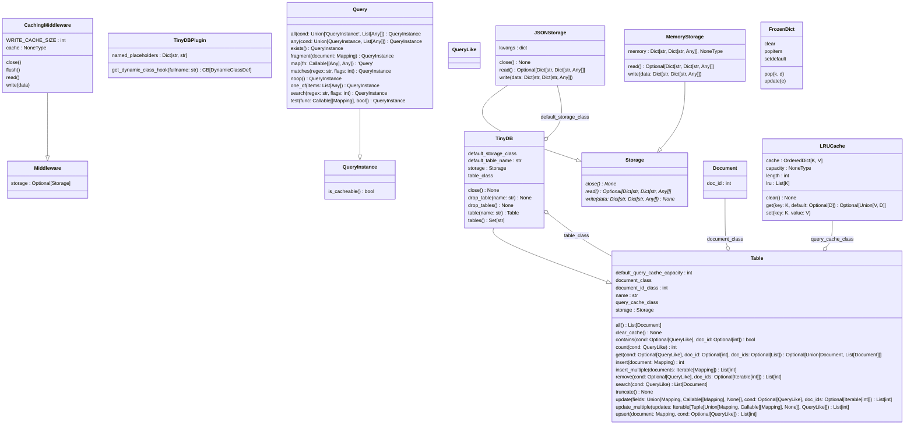
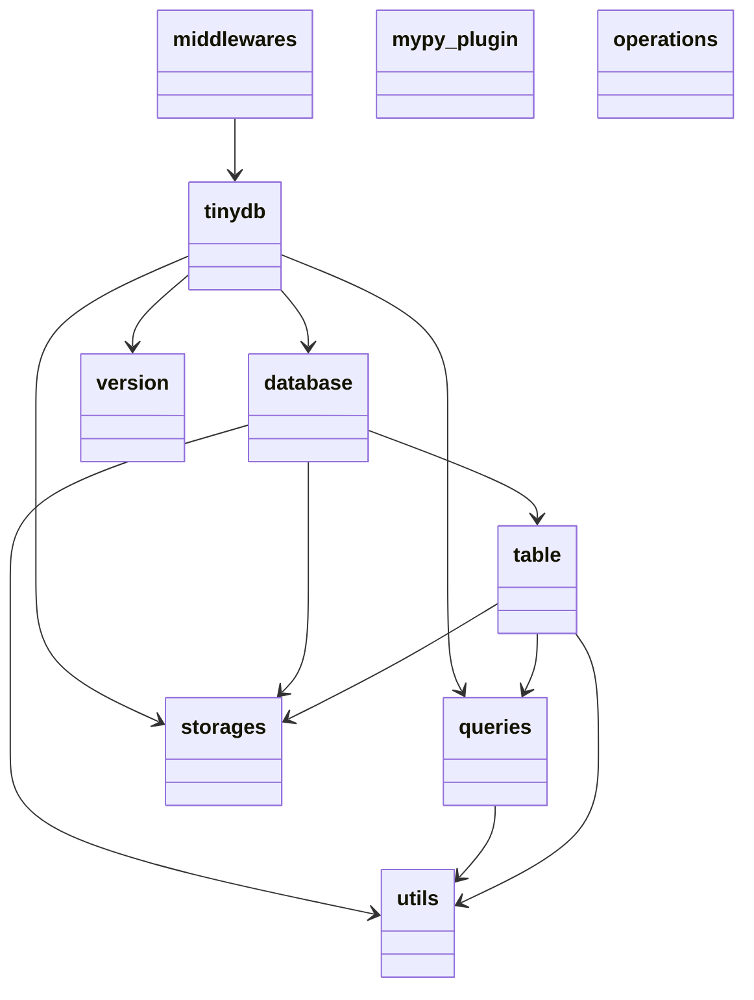

## UML Class Diagram

```mermaid
classDiagram
  class TinyDB {
    default_storage_class
    default_table_name : str
    storage : Storage
    table_class
    close() None
    drop_table(name: str) None
    drop_tables() None
    table(name: str) Table
    tables() Set[str]
  }
  class CachingMiddleware {
    WRITE_CACHE_SIZE : int
    cache : NoneType
    close()
    flush()
    read()
    write(data)
  }
  class Middleware {
    storage : Optional[Storage]
  }
  class TinyDBPlugin {
    named_placeholders : Dict[str, str]
    get_dynamic_class_hook(fullname: str) CB[DynamicClassDef]
  }
  class Query {
    all(cond: Union['QueryInstance', List[Any]]) QueryInstance
    any(cond: Union[QueryInstance, List[Any]]) QueryInstance
    exists() QueryInstance
    fragment(document: Mapping) QueryInstance
    map(fn: Callable[[Any], Any]) 'Query'
    matches(regex: str, flags: int) QueryInstance
    noop() QueryInstance
    one_of(items: List[Any]) QueryInstance
    search(regex: str, flags: int) QueryInstance
    test(func: Callable[[Mapping], bool]) QueryInstance
  }
  class QueryInstance {
    is_cacheable() bool
  }
  class QueryLike {
  }
  class JSONStorage {
    kwargs : dict
    close() None
    read() Optional[Dict[str, Dict[str, Any]]]
    write(data: Dict[str, Dict[str, Any]])
  }
  class MemoryStorage {
    memory : Dict[str, Dict[str, Any]], NoneType
    read() Optional[Dict[str, Dict[str, Any]]]
    write(data: Dict[str, Dict[str, Any]])
  }
  class Storage {
    close()* None
    read()* Optional[Dict[str, Dict[str, Any]]]
    write(data: Dict[str, Dict[str, Any]])* None
  }
  class Document {
    doc_id : int
  }
  class Table {
    default_query_cache_capacity : int
    document_class
    document_id_class : int
    name : str
    query_cache_class
    storage : Storage
    all() List[Document]
    clear_cache() None
    contains(cond: Optional[QueryLike], doc_id: Optional[int]) bool
    count(cond: QueryLike) int
    get(cond: Optional[QueryLike], doc_id: Optional[int], doc_ids: Optional[List]) Optional[Union[Document, List[Document]]]
    insert(document: Mapping) int
    insert_multiple(documents: Iterable[Mapping]) List[int]
    remove(cond: Optional[QueryLike], doc_ids: Optional[Iterable[int]]) List[int]
    search(cond: QueryLike) List[Document]
    truncate() None
    update(fields: Union[Mapping, Callable[[Mapping], None]], cond: Optional[QueryLike], doc_ids: Optional[Iterable[int]]) List[int]
    update_multiple(updates: Iterable[Tuple[Union[Mapping, Callable[[Mapping], None]], QueryLike]]) List[int]
    upsert(document: Mapping, cond: Optional[QueryLike]) List[int]
  }
  class FrozenDict {
    clear
    popitem
    setdefault
    pop(k, d)
    update(e)
  }
  class LRUCache {
    cache : OrderedDict[K, V]
    capacity : NoneType
    length : int
    lru : List[K]
    clear() None
    get(key: K, default: Optional[D]) Optional[Union[V, D]]
    set(key: K, value: V)
  }
  TinyDB --|> Table
  CachingMiddleware --|> Middleware
  Query --|> QueryInstance
  JSONStorage --|> Storage
  MemoryStorage --|> Storage
  JSONStorage --o TinyDB : default_storage_class
  Document --o Table : document_class
  Table --o TinyDB : table_class
  LRUCache --o Table : query_cache_class

```

## UML package diagram

```mermaid
classDiagram
  class tinydb {
  }
  class database {
  }
  class middlewares {
  }
  class mypy_plugin {
  }
  class operations {
  }
  class queries {
  }
  class storages {
  }
  class table {
  }
  class utils {
  }
  class version {
  }
  tinydb --> database
  tinydb --> queries
  tinydb --> storages
  tinydb --> version
  database --> storages
  database --> table
  database --> utils
  middlewares --> tinydb
  queries --> utils
  table --> queries
  table --> storages
  table --> utils

```