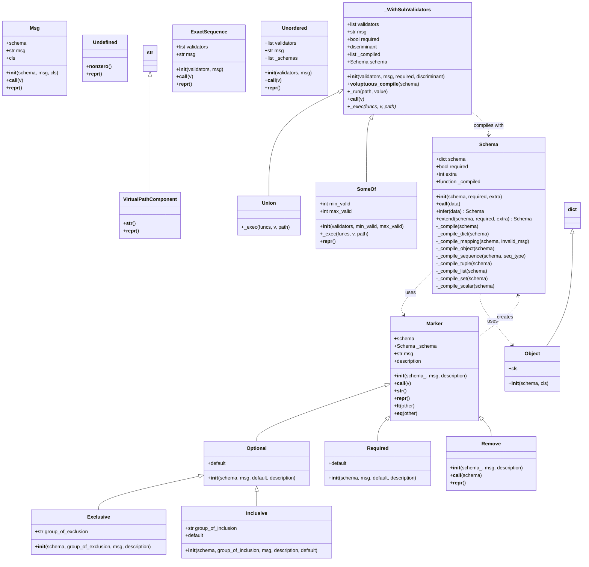
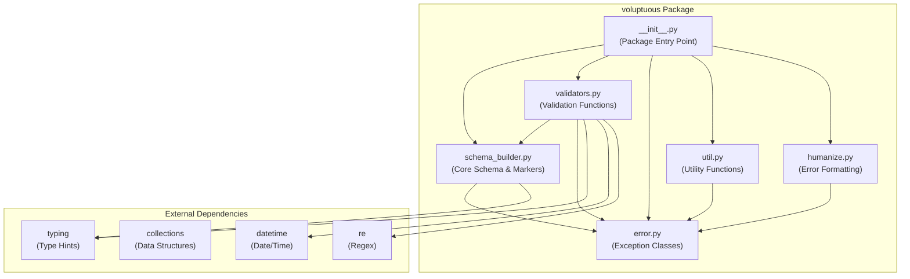
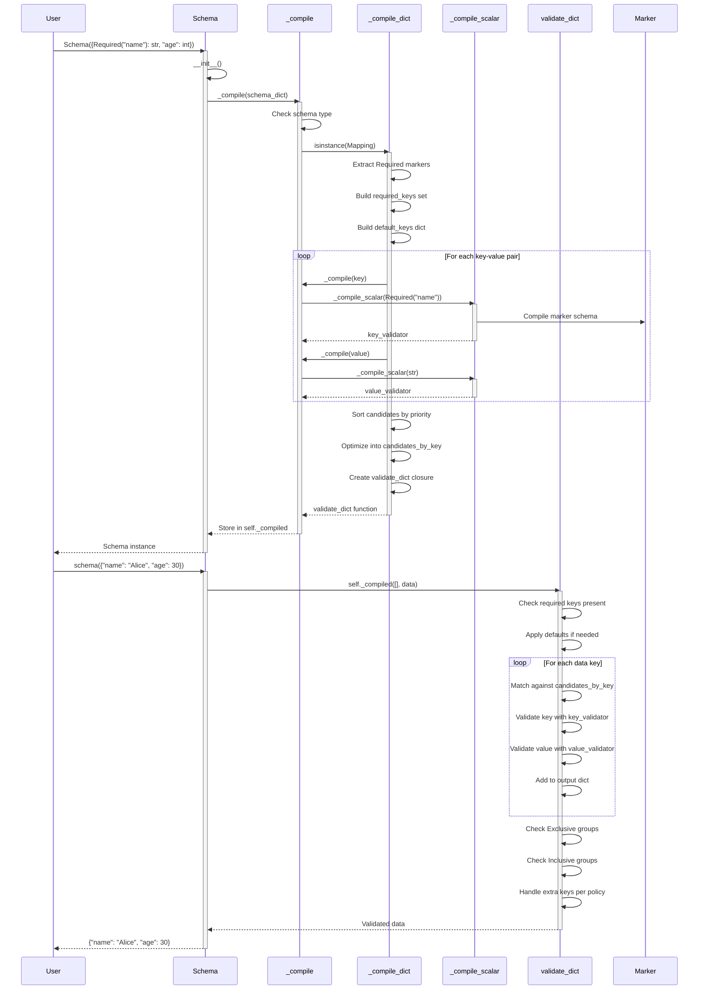

I understand you're asking for UML diagrams for the voluptuous validation library. <cite/> Let me generate three types of diagrams: a class diagram showing the main classes and their relationships, a package relationship diagram, and a sequence diagram showing the validation flow. <cite/>

## UML Class Diagram

## Package Relationship Diagram

## Sequence Diagram: Schema Validation Flow

